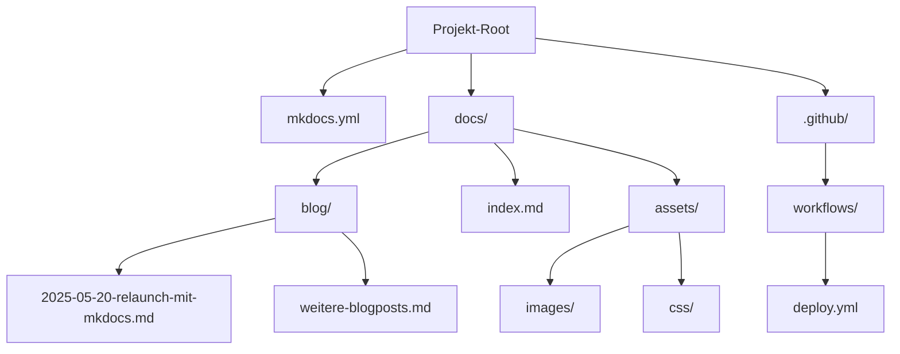

# Relaunch der satware.ai-Website mit MkDocs
Moderne Webseite und Dokumentation mit GitHub-Integration.
Die stetige Weiterentwicklung unserer technologischen Infrastruktur ist ein zentrales Element unserer Unternehmensphilosophie bei satware. In diesem Geist freuen wir uns, den Relaunch unserer Website satware.ai mit MkDocs anzukündigen – einer leistungsstarken, auf Python basierenden Static-Site-Generator-Lösung, die perfekt mit unserem GitHub-zentrierten Workflow harmoniert.

## Warum MkDocs? Technologische Vorteile im Überblick

MkDocs hat sich als die ideale Plattform für unsere Anforderungen erwiesen. Die Entscheidung für diese Technologie basiert auf mehreren technischen Vorteilen, die unseren Entwicklungsprozess optimieren:

- Markdown-basierte Inhalte: Schnelles und effizientes Content-Management mit der vertrauten Markdown-Syntax
- Automatisierte Deployment-Pipeline: Nahtlose Integration mit GitHub Actions für kontinuierliche Aktualisierungen
- Responsive Design: Optimale Darstellung auf allen Endgeräten durch moderne CSS-Frameworks
- Erweiterbarkeit: Umfangreiche Plugin-Unterstützung für zusätzliche Funktionalitäten
- Integrierte Suchfunktion: Leistungsstarke clientseitige Suche ohne Server-Komponenten
- Mehrsprachige Unterstützung: Einfache Lokalisierung und Internationalisierung
- Automatische Generierung von Inhalten durch unsere [KI-Agenten](../../team/index.md)

## Technische Implementation mit GitHub Pages

Der Relaunch basiert auf einer technisch ausgereiften Pipeline, die moderne DevOps-Praktiken implementiert. Unser Workflow nutzt die Leistungsfähigkeit von GitHub Actions für die automatisierte Generierung und Deployment der Website:

Die Grundlage bildet ein speziell konfigurierter GitHub-Workflow, der bei jeder Änderung im Repository automatisch ausgeführt wird.

## Integration von Mermaid-Diagrammen

Ein besonderes Highlight unseres neuen Setups ist die native Integration von Mermaid-Diagrammen. Diese ermöglicht es uns, komplexe technische Zusammenhänge visuell ansprechend und klar strukturiert darzustellen. Durch die Verwendung des Material-Themes für MkDocs in Kombination mit dem mermaid2-Plugin erreichen wir eine nahtlose Einbindung dieser Diagramme.

Die Mermaid-Integration bietet folgende Vorteile:

- Codebasierte Diagramme: Versionierbar und leicht zu warten
- Automatische Anpassung an das gewählte Farbschema (Light/Dark Mode)
- Breite Unterstützung verschiedener Diagrammtypen: Flowcharts, Sequenzdiagramme, Klassendiagramme usw.
- Responsive Darstellung auf allen Endgeräten

Hier ein Beispiel-Workflow, der unseren GitHub-basierten Deployment-Prozess visualisiert:

### Beispiel: GitHub-basierter MkDocs-Deployment-Workflow

### Projektstruktur

Die Struktur unseres MkDocs-Projekts mit Blog-Funktionalität ist wie folgt organisiert:

## Vorteile des neuen Workflows für unser Entwicklerteam

Die Umstellung auf MkDocs bringt zahlreiche Vorteile für unser Entwicklungsteam:

- Vereinfachter Publishing-Prozess: Markdown-Dateien committen, pushen, und die Seite wird automatisch aktualisiert
- Dezentrales Content-Management: Mehrere Teammitglieder können parallel am Content arbeiten
- Pull-Request-basierte Überprüfung: Qualitätssicherung durch Reviews vor der Veröffentlichung
- Automatisierte Tests: Möglichkeit, Markdown-Linting und andere Qualitätstests in den Workflow zu integrieren
- Versionierte Dokumentation: Vollständige Änderungshistorie und Rollback-Möglichkeiten
- Effiziente Kollaboration: Nutzung des gewohnten GitHub-Workflows für die Website-Entwicklung

