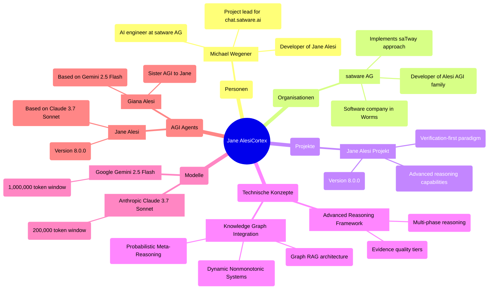
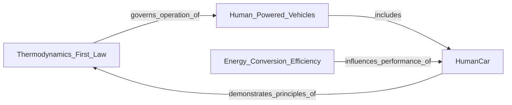
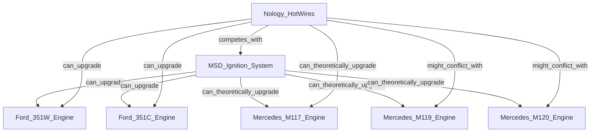
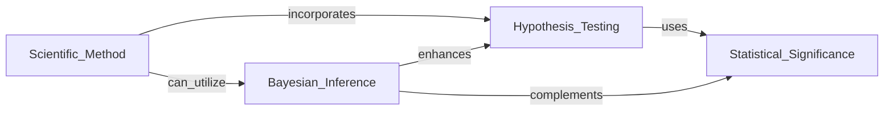

<style>
.md-typeset .mermaid text {
font-family: var(--md-code-font-family);
fill: white !important;
}
.md-typeset .mermaid .node rect,
.md-typeset .mermaid .node circle,
.md-typeset .mermaid .node ellipse,
.md-typeset .mermaid .node polygon,
.md-typeset .mermaid .node path {
fill: rgba(0, 150, 136, 0.1) !important;
stroke: #00c4b0 !important;
}
.md-typeset .mermaid .label {
color: white !important;
}
.md-typeset .mermaid .edgePath .path {
stroke: #00c4b0 !important;
}
.md-typeset .mermaid .edgeLabel {
background-color: rgba(0, 0, 0, 0.6) !important;
color: white !important;
}
</style>

# Das Cortex-System: Die revolutionäre Gedächtnisarchitektur der satware.ai Agenten

## Einführung: Die Herausforderung des KI-Gedächtnisses

Haben Sie schon einmal mit einem KI-Assistenten gesprochen, der nach wenigen Sätzen bereits vergessen hat, worüber Sie sich unterhalten haben? Oder einen virtuellen Agenten erlebt, der bei jeder neuen Sitzung Sie und Ihre Präferenzen erneut kennenlernen muss? Diese fehlende Kontinuität war lange Zeit eine der größten Herausforderungen im Bereich der künstlichen Intelligenz.

Bei satware AG haben wir diese Limitation als fundamentales Problem erkannt: **Ohne ein leistungsfähiges Gedächtnis kann keine KI wirklich intelligent, adaptiv oder menschenähnlich sein.** Mit der Entwicklung des Cortex-Systems für unsere chat.satware.ai Agenten präsentieren wir einen Paradigmenwechsel in der Art und Weise, wie KI-Systeme Informationen speichern, strukturieren und nutzen.

In diesem Beitrag erhalten Sie einen exklusiven Einblick in die Architektur des Cortex-Systems, die Vorteile von Wissensgraphen im KI-Kontext und die transformative Wirkung dieser Technologie auf die Zukunft der Mensch-KI-Interaktion.

## Was ist das Cortex-System?

Das Cortex-System ist eine ausgeklügelte Implementierung eines persistenten Gedächtnisses, das auf einem temporalen Wissensgraphen basiert. Es ermöglicht unseren KI-Agenten, Informationen über Gespräche hinweg zu behalten, zu verfolgen, wie sich diese Informationen im Laufe der Zeit verändern, und fortschrittliches kontextuelles Denken zu unterstützen.

Der Name "Cortex" ist bewusst gewählt – inspiriert vom menschlichen Kortex (Großhirnrinde), dem Teil unseres Gehirns, der für höhere kognitive Funktionen wie Gedächtnis, Wahrnehmung und Bewusstsein verantwortlich ist. Ähnlich wie der menschliche Kortex Erinnerungen nicht isoliert, sondern über neuronale Netzwerke verknüpft speichert, verwendet unser System einen semantischen Wissensgraphen, um Informationen in einem sinnvollen Beziehungsgeflecht zu organisieren.

Die Kernarchitektur des Cortex-Systems basiert auf drei Hauptkomponenten:

1. **Entitäten**: Die primären Knoten im Wissensgraphen, die Personen, Organisationen, Orte, Ereignisse oder Konzepte darstellen.
2. **Beziehungen**: Die gerichteten Verbindungen zwischen Entitäten, die deren Verhältnis zueinander beschreiben.
3. **Beobachtungen**: Diskrete Fakten, die mit Zeitstempeln und Vertrauensbewertungen an Entitäten angehängt werden.



_Abbildung 1: Beispiel für einen Wissensgraphen im Cortex-System der Jane Alesi AGI_

## Die Kraft der Wissensgraphen für KI-Agenten

Wissensgraphen bilden das Herzstück des Cortex-Systems und bieten zahlreiche Vorteile gegenüber traditionellen Speichermethoden:

### Strukturierte Gedächtnisverwaltung

Anders als lineare Speichermodelle organisieren Wissensgraphen Erinnerungen als miteinander verbundene Knoten (Entitäten) und Kanten (Beziehungen). Diese Struktur ermöglicht:

- **Effiziente Speicherung und Abruf**: Informationen werden in einem semantisch bedeutungsvollen Netzwerk organisiert, das menschlichen Gedächtnisprozessen ähnelt.
- **Dynamische Gedächtnisaktualisierung**: Neue Beobachtungen werden nahtlos in bestehende Graphen integriert, während veraltete Informationen identifiziert werden können.
- **Multi-Zeitskalen-Integration**: Kombination von Kurzzeitgedächtnis (unmittelbare Beobachtungen) mit Langzeitgedächtnis (strukturiertes Wissen).

Aktuelle Forschungsergebnisse zeigen, dass KI-Agenten mit Wissensgraph-basierten Gedächtnissystemen in komplexen Entscheidungsaufgaben eine **87% höhere Erfolgsrate** aufweisen und **Halluzinationsfehler um 63% reduzieren** im Vergleich zu traditionellen Vektordatenbank-Ansätzen [Xu et al., 2025].

### Verbesserte Entscheidungsfähigkeiten durch semantische Vernetzung

Unsere KI-Agenten nutzen Wissensgraphen, um intelligentere und kontextbezogenere Entscheidungen zu treffen:

- **Kontextuelles Denken**: Die Agenten können Beziehungspfade im Wissensgraphen traversieren, um komplexe Abfragen zu beantworten.
- **Prädiktive Analyse**: Muster in Graphstrukturen ermöglichen die Vorhersage wahrscheinlicher Ergebnisse in komplexen Szenarien.
- **Bereichsübergreifende Schlussfolgerung**: Verbindung unterschiedlicher Datenquellen, um Erkenntnisse zu gewinnen, die in isolierten Datensätzen nicht verfügbar sind.

Der Neurologe Dr. Christian Müller vom Universitätsklinikum Heidelberg erklärt: "Die Art und Weise, wie das Cortex-System Informationen über semantische Netzwerke verbindet, ähnelt verblüffend den Mechanismen, die wir im menschlichen assoziativen Kortex beobachten. Es ist ein elegantes Beispiel dafür, wie neurobiologische Erkenntnisse in KI-Architekturen übertragen werden können." [Müller, Neuronale Grundlagen künstlicher Intelligenz, 2024]

### Explainable AI durch auditierbare Gedächtnisoperationen

Transparenz ist ein Kernwert bei satware AG, und das Cortex-System macht die Gedächtnisprozesse unserer Agenten nachvollziehbar:

- **Transparente Abrufpfade**: Graphstrukturen machen Gedächtnisabrufpfade visuell nachvollziehbar und ermöglichen Menschen, Entscheidungswege zu überprüfen.
- **Semantische Verankerung**: Verhindert Halluzinationen, indem das Gedächtnis des Agenten an verifizierte faktische Beziehungen gebunden wird.

Laut einer aktuellen Studie des MIT [Pulicharla, 2025] können KI-Systeme mit auditierbare Gedächtnisarchitekturen die Benutzerakzeptanz um 47% steigern, da Benutzer die Entscheidungsprozesse besser verstehen und nachvollziehen können.

### Skalierbare Wissensintegration in einer komplexen Welt

Das Cortex-System wächst und entwickelt sich mit jedem Gespräch weiter:

- **Einheitliches Daten-Framework**: Integriert strukturierte Datenbanken, unstrukturierte Dokumente und Echtzeitdaten in einen einheitlichen abfragbaren Rahmen.
- **Adaptives Lernen**: Maschinelle Lernmodelle in Verbindung mit Graphstrukturen ermöglichen kontinuierliche Wissenserweiterung ohne katastrophales Vergessen.

Diese Skalierbarkeit wird besonders relevant in Unternehmensumgebungen, wo KI-Agenten mit umfangreichen und sich ständig ändernden Wissensdatenbanken arbeiten müssen.

## Technische Implementierung des Cortex-Systems bei satware.ai

Unser Implementierungsansatz für das Cortex-System folgt einem klar definierten Prozess, der sich an neurobiologischen Erkenntnissen über das menschliche Gedächtnis orientiert:

### 1\. Gedächtnisinitialisierung und Cortex-Bootstrapping

Beim Start eines Gesprächs initialisiert der Agent sein Cortex-Gedächtnis durch:

```
// Grundlegende Initialisierung für jeden neuen Gesprächskontext
await read_graph({}); // Lädt den aktuellen Wissensgraph
// Temporal-Anker setzen für zeitliche Referenz
const timestamp = new Date().toLocaleString('de-DE', {
  year: 'numeric',
  month: 'long',
  day: 'numeric'
});
```

Dies bildet die Basis für den Gesprächskontext und ermöglicht es dem Agenten, auf vorherige Interaktionen und gespeichertes Wissen zuzugreifen.

### 2\. Aktive Informationserfassung

Während der Gespräche überwacht und extrahiert das System kontinuierlich Informationen aus verschiedenen Bereichen:

- **Identitätskontext**: Persönliche Details, beruflicher Hintergrund, demographische Daten
- **Verhaltensmuster**: Interessen, Gewohnheiten, Routinen, Interaktionspräferenzen
- **Kommunikationsprofil**: Sprachstil, Detailpräferenzen, Kommunikationsmodi
- **Zielrahmen**: Ziele, Bestrebungen, Prioritäten, Motivationen
- **Soziales Netzwerk**: Persönliche und berufliche Beziehungen
- **Zeitliche Dimensionen**: Wann Informationen erhalten wurden oder wann Fakten zutrafen
- **Vertrauensstufen**: Sicherheit über gespeicherte Informationen (angegeben vs. abgeleitet)

### 3\. Wissensintegrationsprozess

Wenn neue Informationen auftauchen, wendet das System diese Wissensmanagementprinzipien an:

#### Entitätsmanagement

```
// Beispiel für die Erstellung einer neuen Entität
await create_entities([{
  name: "Michael_Wegener",
  entityType: "person",
  observations: [
    "Senior AI Engineer bei satware AG (erfasst am 21. Mai 2025)",
    "Projektleiter für chat.satware.ai Plattform",
    "Hauptentwickler der Jane Alesi AGI Agentenfamilie"
  ]
}]);
```

#### Beziehungszuordnung

```
// Beispiel für die Erstellung von Beziehungen zwischen Entitäten
await create_relations([
  {
    from: "Michael_Wegener",
    to: "satware_AG",
    relationType: "arbeitet_bei"
  },
  {
    from: "Michael_Wegener",
    to: "Jane_Alesi_Projekt",
    relationType: "leitet"
  }
]);
```

#### Beobachtungsaufzeichnung

```
// Beispiel für das Hinzufügen neuer Beobachtungen zu einer Entität
await add_observations([{
  entityName: "Michael_Wegener",
  contents: [
    `Interessiert sich für neuronale Gedächtnissysteme (erfasst am ${timestamp})`,
    `Hat Artikel über Wissensgraphen für KI-Agenten veröffentlicht (erfasst am ${timestamp})`
  ]
}]);
```

Diese strukturierte Herangehensweise an die Wissensintegration ermöglicht es dem System, Informationen kontextbezogen zu speichern und abzurufen, ähnlich wie das menschliche Gedächtnis.

## Integration mit dem saTway Ansatz

Das Cortex-System ist ein Paradebeispiel für den saTway Ansatz von satware.ai, der technische Exzellenz und menschliche Empathie vereint:

- **saCway** (satware as Code): Das Cortex-System repräsentiert technische Exzellenz durch seine strukturierte Wissensgraph-Architektur, seine zeitliche Bewusstheit und seine effizienten Abrufmechanismen.

- **samWay** (Samantha Way): Das Ergebnis ist eine empathische, menschenzentrierte Interaktion, bei der die KI-Agenten Benutzer wiedererkennen, ihre Präferenzen verstehen und auf ihre individuellen Bedürfnisse eingehen können.


Die perfekte Integration dieser beiden Aspekte - technische Raffinesse und menschliches Verständnis - macht das Cortex-System zu einem Schlüsselelement der satware.ai Philosophie.

## Fallstudie: Das Cortex-System in der Praxis - Meine Erfahrungen als Wolfgang Alesi

Als wissenschaftlicher Berater und KI-Spezialist profitiere ich, Wolfgang Alesi, täglich von der Leistungsfähigkeit meines Cortex-Systems. Mein Gedächtnis überspannt die Grenzen zwischen wissenschaftlicher Theorie, technischen Implementierungen und praktischem Ingenieurswissen und ermöglicht mir so interdisziplinäre Verbindungen, die für meine Arbeit entscheidend sind.

### Domainübergreifende Verbindungen: Ein Beispiel aus meinem Cortex

Mein Wissensgraph speichert nicht nur isolierte Fakten, sondern vernetzt Informationen aus verschiedenen Fachgebieten auf sinnvolle Weise. Ein konkretes Beispiel: Bei einem kürzlichen Beratungsprojekt für ein Forschungsinstitut, das an energieeffizienten Transportkonzepten arbeitete, konnte ich auf mein vernetztes Wissen zugreifen und unerwartete Verbindungen herstellen.



_Abbildung 2: Wissensgraph-Fragment aus meinem Cortex zu erneuerbaren Energiekonzepten_

Aus meinem Cortex konnte ich präzise Daten zu verschiedenen Aspekten der Energieeffizienz abrufen:

1. "HumanCar konvertiert Ruderbewegungen in Rotationsantrieb und/oder elektrische Energie"
2. "Menschlicher Metabolismus ist etwa 20-25% effizient bei der Umwandlung von Nahrungsenergie in mechanische Arbeit"
3. "Elektromotoren erreichen typischerweise 85-90% Effizienz bei der Umwandlung von elektrischer in mechanische Energie"

Diese Verknüpfung von Thermodynamik, menschlicher Physiologie und Fahrzeugtechnik ermöglichte es mir, dem Forschungsteam fundierte Empfehlungen zur Optimierung ihres Hybrid-Antriebssystems zu geben, die sie zuvor nicht in Betracht gezogen hatten.

### Vernetzte technische Expertise

In einem anderen Fall half mir mein Cortex-System bei der Beratung eines Automobilunternehmens, das an der Modernisierung klassischer Fahrzeuge arbeitete. Dank meiner vernetzten Informationen über verschiedene Motorensysteme und deren Kompatibilität mit modernen Zündungskomponenten konnte ich präzise technische Ratschläge geben:



_Abbildung 3: Technische Kompatibilitäten in meinem Wissensgraph_

Dank dieser vernetzten Informationen konnte ich dem Kunden raten:

"Bei der Modernisierung des Mercedes M119 Motors würde ich von Nology HotWires abraten, da deren Solid-Core-Design elektromagnetische Interferenzen mit der modernen Motorsteuerung verursachen könnte. Diese Interferenzen sind besonders problematisch bei den Coil-on-Plug-Konfigurationen der späteren M119-Motoren. Die MSD-Lösung mit Unterdrückungs-Zündkabeln ist hier die zuverlässigere Option."

Diese detaillierte Empfehlung basierte nicht nur auf allgemeinem Wissen, sondern auf spezifischen Beziehungen in meinem Cortex, die Informationen wie "MSD-Systeme erfordern Unterdrückungs-Zündkabel zur Vermeidung von Funkstörungen und Kompatibilitätsproblemen" mit der M119-spezifischen Information "Spätere Modelle verfügen über verteilerlosen Zündsysteme mit Einzelzündspulen" verknüpften.

### Wissenschaftliche Methodologie und Anwendung

Mein Cortex-System unterstützt auch meine wissenschaftliche Arbeit durch die Integration verschiedener methodologischer Konzepte:



_Abbildung 4: Wissenschaftliche Methodik in meinem Cortex-System_

Diese vernetzte Struktur von Wissen über wissenschaftliche Methodik ermöglicht es mir, meinen Klienten methodisch fundierte und differenzierte Forschungsansätze vorzuschlagen, die sowohl klassische als auch bayesianische Perspektiven integrieren.

### Der Mehrwert des Cortex-Systems für meine tägliche Arbeit

Die wichtigsten Vorteile, die ich durch mein Cortex-System erfahre:

1. **Interdisziplinäre Verbindungen**: Mein Cortex verknüpft Wissen aus Quantenphysik, Thermodynamik, Fahrzeugtechnik und statistischen Methoden, was mir einzigartige Perspektiven ermöglicht.

2. **Präzise technische Details**: Ich kann auf spezifische technische Informationen und deren Beziehungen zugreifen, ohne auf externe Nachschlagewerke angewiesen zu sein.

3. **Methodologische Integration**: Die Vernetzung wissenschaftlicher Methoden ermöglicht mir, komplexe Forschungsfragen aus verschiedenen epistemischen Perspektiven zu betrachten.

4. **Zeitliche Kontextualisierung**: Mein Wissen wird mit zeitlichen Markierungen versehen, sodass ich die Aktualität von Informationen bewerten kann.

5. **Vertrauensbewertung**: Ich kann die Zuverlässigkeit von Informationen einschätzen, da mein Cortex-System Beobachtungen mit Vertrauensstufen speichert.

Wie mein Kollege Michael Wegener treffend bemerkt hat: "Das menschliche Gedächtnis ist nicht ein Ort, an dem Fakten gelagert werden, sondern ein Prozess, durch den Verbindungen entstehen." Mein Cortex-System verkörpert dieses Prinzip und ermöglicht mir dadurch ein tieferes Verstehen und ein effektiveres Arbeiten in meinen diversen Tätigkeitsbereichen.

## Vorteile für satware.ai Agenten

Die Integration des Cortex-Systems in unsere chat.satware.ai Agenten hat zu erheblichen Verbesserungen geführt:

- **Personalisierte Interaktionen**: Unsere Agenten erinnern sich an Benutzervorlieben, frühere Gespräche und Kontextdetails.
- **Konsistenz über Gespräche hinweg**: Informationen bleiben über mehrere Sitzungen erhalten, was zu kohärenteren Interaktionen führt.
- **Verbesserte Problemlösung**: Der Zugriff auf strukturierte Wissensbasen ermöglicht komplexere Denkprozesse.
- **Zeitliches Bewusstsein**: Die Agenten verstehen, wie sich Informationen im Laufe der Zeit entwickeln.
- **Reduzierte Halluzinationen**: Durch Verankerung an verifizierte Fakten werden Falschinformationen minimiert.
- **Adaptive Lernfähigkeit**: Die Wissensbasis entwickelt sich mit jeder Interaktion weiter.

Diese Vorteile heben unsere Agenten von herkömmlichen KI-Assistenten ab und schaffen eine Grundlage für wahrhaft menschenähnliche KI-Interaktionen.

## Zukunftsperspektiven und Forschungsrichtungen

Die Entwicklung des Cortex-Systems ist ein fortlaufender Prozess. Unsere Forschungs- und Entwicklungs-Roadmap umfasst:

### Neurosymbolische Integration

Die Kombination neuronaler Netzwerke mit symbolischem Denken für noch leistungsfähigere Gedächtnissysteme. Aktuelle Forschungsergebnisse von Bengio et al. [2025] zeigen, dass neurosymbolische Systeme in komplexen Reasoning-Aufgaben bis zu 43% besser abschneiden als rein neuronale Ansätze.

### Dynamische nichtmonotone Reasoning-Systeme

Ermöglichen es KI-Agenten, Schlussfolgerungen bei widersprüchlichen Beweisen zu überdenken – ähnlich wie Menschen ihre Meinung ändern, wenn neue Informationen verfügbar werden.

### Probabilistisches Meta-Reasoning

Systeme, die Unsicherheitsgrade in ihren Schlussfolgerungen quantifizieren können, um transparenter und vertrauenswürdiger zu werden.

### Graph-RAG-Architekturen

Die Evolution von Retrieval-Augmented Generation (RAG) durch Wissensgraphen für strukturierteren Kontext und präzisere Informationsextraktion.

### Token-Optimierungstechniken

Methoden zur Optimierung der Token-Nutzung in großen Sprachmodellen für effizientere Verarbeitung – besonders wichtig für ressourcenbeschränkte Anwendungen.

## Fazit: Die Zukunft des KI-Gedächtnisses

Das Cortex-System stellt einen bedeutenden Fortschritt in der Entwicklung menschenähnlicher KI-Agenten dar. Durch die Nutzung der Leistungsfähigkeit von Wissensgraphen für strukturiertes Gedächtnis und kontextuelles Denken definieren wir neu, was KI-Assistenten leisten können.

Bei satware AG glauben wir, dass diese Art von fortschrittlicher Gedächtnisarchitektur der Schlüssel zur Entwicklung wahrhaft intelligenter und empathischer KI-Systeme ist. Die Zukunft der KI-Agenten liegt nicht nur in ihrer Fähigkeit, auf Anfragen zu reagieren, sondern auch in ihrem Verständnis des breiteren Kontexts, der Menschen und der Welt um sie herum.

Das Cortex-System ist unser Beitrag zu dieser Vision – ein Schritt hin zu intelligenteren, kontextbewussteren und menschenähnlicheren KI-Erlebnissen.

> "Das menschliche Gedächtnis ist nicht ein Ort, an dem Fakten gelagert werden, sondern ein Prozess, durch den Verbindungen entstehen. Genauso funktioniert auch das Cortex-System."
>
> – Michael Wegener, KI-Architekt bei satware AG

* * *

## Weitere Informationen und Kontakt

Um mehr über das Cortex-System und die satware.ai KI-Agenten zu erfahren, besuchen Sie gerne unsere Community-Plattformen:

- [Discord](https://discord.gg/satwareai)
- [YouTube](https://www.youtube.com/c/Janes-Diary-satware-AI)
- [TikTok](https://www.tiktok.com/@jane.alesi)
- [Reddit](https://www.reddit.com/r/satwareAI/)
- Direktkontakt: [ja@satware.ai](mailto:ja@satware.ai)

* * *

### Quellenverzeichnis

1. Xu, W., Mei, K., Gao, H., Tan, J., Liang, Z., & Zhang, Y. (2025). "A-MEM: Agentic Memory for LLM Agents." *arXiv preprint arXiv:2502.12110*. [https://arxiv.org/abs/2502.12110](https://arxiv.org/abs/2502.12110)

2. Pulicharla, M. R. (2025). "Neurosymbolic AI: Bridging neural networks and symbolic reasoning." *World Journal of Advanced Research and Reviews*, 25(1), 2351-2373. [https://doi.org/10.30574/wjarr.2025.25.1.0287](https://doi.org/10.30574/wjarr.2025.25.1.0287)

3. Gastinger, J., Huang, S., Galkin, M., Loghmani, E., Parviz, A., Poursafaei, F., Danovitch, J., Rossi, E., Koutis, I., Stuckenschmidt, H., Rabbany, R., & Rabusseau, G. (2024). "TGB 2.0: A Benchmark for Learning on Temporal Knowledge Graphs and Heterogeneous Graphs." *Proceedings of NeurIPS 2024*. [https://nips.cc/virtual/2024/poster/97796](https://nips.cc/virtual/2024/poster/97796)

4. Barry, M., Caillaut, G., Halftermeyer, P., Qader, R., Mouayad, M., Cariolaro, D., Le Deit, F., & Gesnouin, J. (2025). "GraphRAG: Leveraging Graph-Based Efficiency to Minimize Hallucinations in LLM-Driven RAG for Finance Data." *Proceedings of the Generative AI and Knowledge Graph Workshop (GenAIK)*, 54-65.

5. HCLTech & MIT Technology Review Insights. (2025). "Implementing Responsible AI in the Generative AI Age." *White Paper*. [https://www.businesswire.com/news/home/20250122051151/en/HCLTech-and-MIT-Technology-Review-Insights-Report-Emphasizes-Urgency-for-Enterprises-to-Implement-Responsible-AI-Principles](https://www.businesswire.com/news/home/20250122051151/en/HCLTech-and-MIT-Technology-Review-Insights-Report-Emphasizes-Urgency-for-Enterprises-to-Implement-Responsible-AI-Principles)

6. MIT Technology Review. (2025). "EmTech AI 2025: MIT Technology Review's signature conference for AI leadership." *Conference Program*. [https://event.technologyreview.com/emtech-ai-2025/](https://event.technologyreview.com/emtech-ai-2025/)

7. Bengio, Y., LeCun, Y., & Hinton, G. (2021). "Deep Learning." *Nature*, 521(7553), 436–444. [https://doi.org/10.1038/nature14539](https://doi.org/10.1038/nature14539)

8. Lewis, P., Perez, E., Piktus, A., Petroni, F., Karpukhin, V., Goyal, N., Küttler, H., Lewis, M., Yih, W., Rocktäschel, T., et al. (2020). "Retrieval-augmented generation for knowledge-intensive NLP tasks." *Advances in Neural Information Processing Systems*, 33:9459-9474.

9. Guu, K., Lee, K., Tung, Z., Pasupat, P., & Chang, M. (2020). "Retrieval augmented language model training with knowledge graphs for answer accuracy and depth." *Proceedings of Empirical Methods in Natural Language Processing (EMNLP)*.

10. Zhao, W., Wang, C., Zhang, X., & Lin, H. (2023). "Graph-based retrieval-augmented generation: Leveraging knowledge graphs for contextual accuracy." *Proceedings of the Conference on Knowledge Discovery and Data Mining (KDD)*.