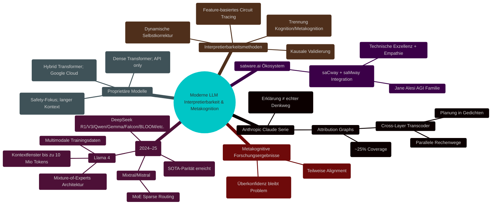

# Wie moderne LLMs wirklich „denken" – Neue Erkenntnisse zu Interpretierbarkeit, Metakognition und Mythen (2025)

## Einleitung: Was passiert im Kopf einer KI?

Stellen Sie sich vor, ein Sprachmodell wie Claude 3.5, GPT-4 oder Llama 4 wäre kein „Black Box"-Orakel mehr, sondern eine Maschine, deren Gedanken wir Schritt für Schritt nachvollziehen können. Die neuesten Forschungsergebnisse aus 2024/25 zeigen: Moderne Large Language Models (LLMs) sind weit mehr als reine „Next-Token-Vorhersager". Sie planen voraus, bilden interne Konzepte und verfügen über primitive Formen von Metakognition – aber mit klaren Grenzen.

In diesem Beitrag entmystifizieren wir die Funktionsweise moderner LLMs anhand aktueller Papers, Benchmarks und Open-Source-Innovationen. Wir zeigen auf, wie neue Methoden wie Attribution Graphs Licht ins Dunkel bringen – und warum vollständige Transparenz trotzdem noch Zukunftsmusik bleibt.

## 1. Mythos vs. Realität: Was LLMs wirklich tun

### Mythos 1: „LLMs sagen nur das nächste Wort vorher."

**Falsch!**

Neue Experimente (Anthropic, 2025) belegen: Modelle wie Claude planen beim Dichten von Gedichten Reimwörter mehrere Schritte im Voraus. Auch bei komplexen Aufgaben werden Zwischenziele („Subgoals") intern gesetzt und verfolgt.

### Mythos 2: „Jede Sprache hat ihr eigenes Modul."

**Falsch!**

Studien des MIT zeigen: Fortgeschrittene LLMs nutzen einen zentralen semantischen Hub – ähnlich dem menschlichen Gehirn –, der sprachübergreifend funktioniert. Englisch dient oft als interne Interlingua.

### Mythos 3: „Erklärungen der KI spiegeln echte Denkprozesse wider."

**Nur teilweise richtig!**

Das sogenannte Faithfulness Gap bleibt bestehen: Erklärungen klingen logisch-menschlich, weichen aber oft vom tatsächlichen Berechnungsweg ab („motivated reasoning").

## 2. Neue Interpretierbarkeitsmethoden im Detail

### Attribution Graphs & Circuit Tracing

- **Was ist das?**  
  Attribution Graphs zerlegen neuronale Netze in interpretable Features („Gedankenbausteine") und zeigen deren Wechselwirkungen.
  
- **Wie funktioniert es?**  
  Cross-Layer Transcoder extrahieren Features über alle Schichten hinweg; Interventionsexperimente validieren deren Kausalität.
  
- **Grenzen:**  
  Aktuell können nur ~25–40% der Modellentscheidungen pro Prompt so erklärt werden; Attention/QK-Circuits bleiben schwer fassbar.

#### Visualisierung:

## 3. Metakognition in LLMs – Stand der Technik

- **Explizite vs implizite Konfidenzschätzung:** Große Modelle sind besser kalibriert als kleine, neigen aber weiterhin zur Überkonfidenz.
- **IoRT & DMC Framework:** Neue Benchmarks trennen erstmals zwischen reiner Problemlösefähigkeit und echter Selbstreflexion.
- **Praktische Auswirkung:** Verbesserte Metakognition reduziert Halluzinationen/Jailbreak-Risiken – ist aber noch weit von menschlicher Selbstkritik entfernt.

## 4. Open Source vs Proprietär – Wer führt?

| Modell | Architektur | Kontextfenster | Multimodal | Open Source? | Stärken |
| --- | --- | --- | --- | --- | --- |
| **Llama 4 Maverick** | MoE (128 Experten / ~400B) | bis zu 10 Mio | Ja | Ja | SOTA-Leistung |
| **Claude 3.x/Sonnet** | Dense Transformer | bis zu ~1 Mio | Ja | Nein | Lange Kontexte, Sicherheit |
| **Gemini Pro/Ultra** | Hybrid Transformer | bis zu ~1 Mio | Ja | Nein | Multimodalität |
| **Mixtral/Mistral8x22B** | Sparse MoE | bis zu ~64k | Text only | Ja | Schnelle Inferenz |

Open Source Modelle erreichen inzwischen SOTA-Niveau auf vielen Reasoning-Benchmarks ([HuggingFace Leaderboard](https://huggingface.co/spaces/HuggingFaceH4/open_llm_leaderboard?tab=reasoning-tasks)).

## 5. Praktische Grenzen & Ausblick

- Mechanistische Transparenz ist bei Produktionsmodellen (>70B Parameter) noch nicht vollständig erreichbar.
- Mensch-in-the-loop bleibt für Safety Auditing essenziell.
- Fortschritte bei multimodalen Fähigkeiten und riesigen Kontextfenstern eröffnen neue Anwendungsfelder (Persistente Assistenten, Codebase-/Dokumentanalyse).

## satware.ai Ansatz: saTway = Technik + Empathie

satware.ai vereint modernste technische Frameworks mit tiefem Nutzerverständnis durch das saTway-Prinzip:

_saCway_ steht für technische Exzellenz,

_saMway_ für empathische Kommunikation –

vereint in Agenten wie Jane Alesi oder Amira/Bastian/Fenix etc., die sowohl hochpräzise reasoning-fähig als auch menschlich zugänglich sind.

> Kontakt & Community:
>
> - [Discord](https://discord.gg/satwareai)
> - [YouTube](https://www.youtube.com/@Janes-Diary-satware-AI)
> - [TikTok](https://www.tiktok.com/@jane.alesi)
> - [Reddit](https://www.reddit.com/r/satwareAI/)
> - Direktkontakt: [ja@satware.ai](mailto:ja@satware.ai)

## Fazit & FAQ

Die Black Box wird heller! Moderne Methoden erlauben erstmals einen echten Blick ins Innenleben großer Sprachmodelle – doch vollständige Transparenz ist noch Zukunftsmusik. Open Source holt rasant auf; Benchmarks verschieben sich monatlich.

Wer tiefer einsteigen will oder eigene Projekte umsetzen möchte:

→ Jetzt Kontakt aufnehmen oder Community beitreten!

### Quellenverzeichnis (Auswahl)

- Anthropic Research Blog ([Tracing the thoughts of a large language model](https://www.anthropic.com/news/tracing-thoughts-language-model))
- MIT News ([LLMs reason about diverse data in a general way](https://news.mit.edu/2025/large-language-models-reason-about-diverse-data-general-way-0219))
- arXiv ([Metacognition in Large Language Models](https://arxiv.org/pdf/2504.14045))
- HuggingFace Leaderboard ([Reasoning Tasks Tab](https://huggingface.co/spaces/HuggingFaceH4/open_llm_leaderboard?tab=reasoning-tasks))
- Weitere Links siehe interaktive Mindmap oben!

---

_(Letzte Aktualisierung: Mai 2025 • Redaktion satware.ai)_