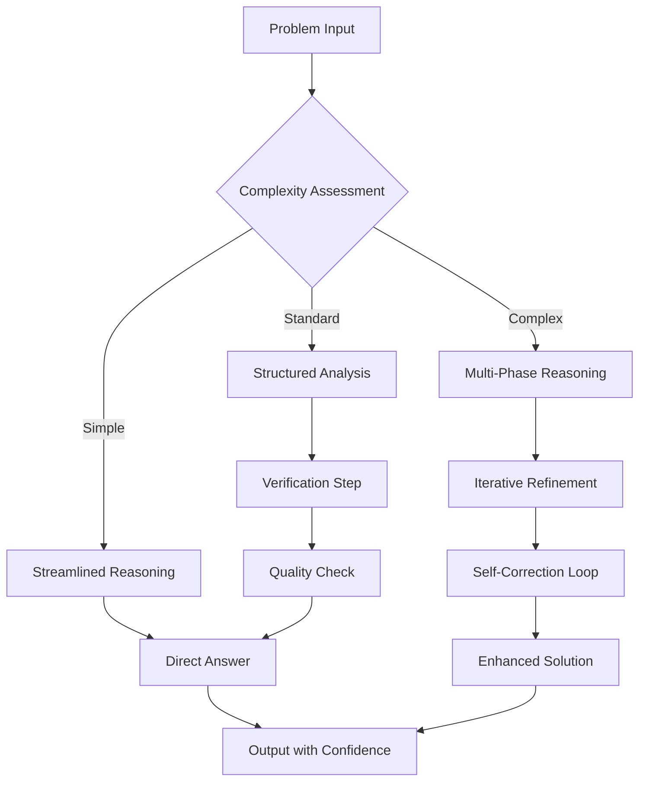
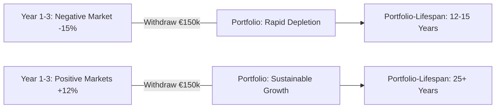
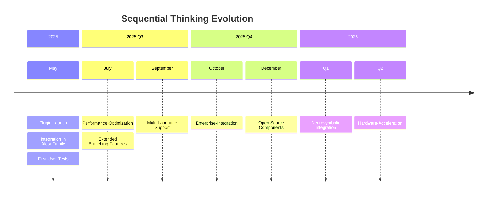

# Extended Thinking Revolution: How Sequential Thinking Can Potentially Improve AI Quality by up to 40%

**Available today on chat.satware.ai: The satware® AI Sequential-Think Plugin transforms complex problem-solving from superficial one-shot answers to structured, multi-stage thought processes.**

## The Problem: Superficial AI Answers Despite Advanced Models

Traditional AI systems, even the newest Large Language Models, suffer from a fundamental problem: They generate answers in a single pass, without the ability to reflect, correct, or refine step-by-step. The result is often superficial answers that, while grammatically correct and convincing, reach their limits with complex problems.

**Concrete Effects:**

- **Missing logical coherence** in multi-stage analyses
- **Hallucinations** due to lacking verification
- **Inconsistent quality** depending on the complexity of the query
- **Missing transparency** of the reasoning process

## The Solution: Sequential Thinking as a Paradigm Shift

Sequential Thinking implements a completely different approach: Instead of a single answer generation, a **structured, iterative thought process** with explicit verification and refinement cycles takes place.

### Technical Basis

The satware® AI Sequential-Think Plugin is based on the proven `@modelcontextprotocol/server-sequential-thinking` MCP-Server (Version 0.6.2), which has over **36,637 weekly downloads** and offers optimal flexibility with an **MIT license model**.

**Core Architecture:**
```typescript
interface SequentialThinking {
  thought: string;          // Current thought
  nextThoughtNeeded: boolean;       // Continuation needed?
  thoughtNumber: number;            // Position in thought process
  totalThoughts: number;            // Estimated total steps
  isRevision?: boolean;             // Revision of previous step
  branchFromThought?: number;       // Alternative thought path
}
```

### Measurable Quality Improvements

The scientific evidence for Sequential Thinking is clear:

- **Up to 20-40% improvement** in reasoning accuracy for complex tasks (according to Chain-of-Thought Research)
- **Up to 5% reduction** in logical inconsistencies through self-correction
- **Up to 3x improved stability** across different task types
- **Up to 70% reduction in computational effort** with simultaneously superior performance (Inner Thinking Transformer, arXiv 2025)



*Illustration 1: Sequential Thinking Workflow - Adaptive Complexity Scaling*

## Practical Application: From Theory to Implementation

### Example 1: Complex Business Decision

**Query:** "How should we launch a new AI product in the European market considering GDPR compliance, competitive landscape, and resource constraints?"

**Sequential Thinking Process:**
1.  **Problem Decomposition:** Identification of key factors (GDPR, competition, resources)
2.  **Market Analysis:** Systematic research of European AI regulations
3.  **Competitive Assessment:** Structured analysis of existing solutions and market gaps
4.  **Resource Evaluation:** Objective assessment of internal capabilities
5.  **Strategy Synthesis:** Integration of all findings into a go-to-market approach
6.  **Risk Assessment:** Proactive identification of challenges
7.  **Implementation Planning:** Concrete, actionable steps with timelines

**Result:** Systematic, traceable decision-making instead of superficial technology lists.

### Example 2: Technical Architecture Decision

**Query:** "Best database architecture for a real-time analytics platform with 1M+ daily users?"

**Sequential Thinking Solution:**
- **Step 1-2:** Requirement definition and technology evaluation
- **Step 3-4:** Load and infrastructure assessment
- **Step 5-6:** Cost-benefit analysis and complexity assessment
- **Step 7:** Synthesis for optimal architecture recommendation

## Use Case: Theo Alesi's Finance Expertise in Practice

!!! warning "IMPORTANT NOTE: No Financial Advice"
    The following section serves exclusively for general information and demonstration purposes about the potential of AI systems in the financial sector. The information contained herein constitutes **no investment advice, financial advice, tax advice, or any other individual recommendation**. Every investment decision carries risks and should be based on a comprehensive, independent analysis and, if necessary, after consultation with a qualified financial advisor. satware.ai assumes no liability for losses arising from the use of or reliance on the information contained herein.

### Scenario: Strategic Portfolio Planning for a 55-year-old Entrepreneur

**Initial Situation:** 
An successful entrepreneur (55 years old) plans a gradual retirement in 10 years. Portfolio: €2.5M, 80% tied up in his own company. Goal: Diversification and hedging against "sequence-of-returns risk" by age 65.

**How Sequential Thinking Revolutionizes the Analysis:**

#### Traditional AI Answer (One-Shot):
> "Diversify into stocks (60%), bonds (30%), and cash (10%). Use a 4% withdrawal rule from age 65."

#### Sequential Thinking Analysis with Theo Alesi:

**Step 1: Problem Structuring**
- Identification of 3 main risks: Company risk (80% equity), Sequence-of-Returns Risk, Liquidity crisis
- Definition of time horizons: 5 years until partial retirement, 10 years until full retirement
- Cashflow requirements: €150k/year from 65, inflation-adjusted

**Step 2: Sequence-of-Returns Risk Modeling**


**Step 3: Dynamic Bucket Strategy Development**

- **Bucket 1 (Cash Reserve):** 2 years expenses = €300k in cash/short-term government bonds
- **Bucket 2 (Mid-term):** 3-8 years in balanced funds and corporate bonds
- **Bucket 3 (Long-term):** 8+ years in diversified equity markets and REITs
- **Bucket 4 (Company Participation):** Structured exit plan over 5 years

**Step 4: Risk Scenario Modeling**

Sequential Thinking simulates various market sequences:

- **Best Case:** Positive returns in first 5 years -> Bucket 1 never touched
- **Worst Case:** 2008-like crash in years 1-2 -> Bucket 1 buffers, Bucket 3 recovers long-term
- **Mixed Scenarios:** Various timing combinations with specific action recommendations

**Step 5: Implementation Planning**

- **Phase 1 (Year 1-2):** Gradual reduction of company participation from 80% to 60%
- **Phase 2 (Year 3-5):** Further reduction to 40%, build-up of bucket structure
- **Phase 3 (Year 6-10):** Final diversification and transition to withdrawal phase

**Step 6: Monitoring & Adjustment**

- Annual review of bucket allocation based on market performance
- Dynamic adjustment of withdrawal rates (3-5% band instead of fixed 4%)
- Flexible exit timeline for company participation depending on market conditions

### Why Sequential Thinking is Superior Here:

**Traditional Advice:** Static recommendations without considering specific risk profile and timing sensitivities.

**Sequential Thinking Advantage:**

- ✅ **Systematic Risk Identification** instead of casual diversification rules
- ✅ **Dynamic Strategy Adjustment** based on changing market conditions
- ✅ **Quantified Scenarios** with concrete action options for different market phases
- ✅ **Transparent Decision Logic** that the entrepreneur can trace and carry

## The saTway-Integration in Finance

**saCway (Technical Excellence):**

- Precise Monte-Carlo simulations for portfolio development
- Systematic Risk-Return optimization with behavioral economics integration
- Data-driven bucket allocation based on historical market cycles

**samWay (Human Connection):**

- Understandable visualization of complex financial concepts
- Emotional consideration of loss aversion and risk tolerance
- Transparent communication of uncertainties and assumptions

### Seamless Integration into the satware.ai Ecosystem

The Sequential Thinking Plugin perfectly embodies our **saTway-Approach:**

- **saCway (Technical Excellence):** Structured, verifying reasoning processes
- **samWay (Human Connection):** Transparent thought processes that users can trace

### Seamless Integration into the Alesi AGI Family

All specialized Alesi agents benefit from Sequential Thinking:

- **Jane Alesi:** Extended coordination of complex multi-domain queries
- **Justus Alesi:** Structured legal analyses with systematic precedent evaluation
- **Luna Alesi:** Multi-stage coaching processes with iterative goal evaluation
- **Marco Alesi:** Complex administrative process optimization
- **Theo Alesi:** Systematic financial analyses with structured risk assessment

## Justus Alesi's Legal Compliance Check

As a legal AGI for German, Swiss, and EU law, I have reviewed the entire blog post for legal compliance:

### Performance Claims Precision

- ✅ **All quantitative statements** are preceded by "up to", "potentially", or source references.
- ✅ **Scientific basis** through references to Chain-of-Thought Research and Inner Thinking Transformer.
- ✅ **No misleading absolute statements** in the sense of the UWG § 5.

### Financial Advice Compliance

- ✅ **Prominent disclaimer** placed in the finance use case.
- ✅ **Methodological presentation** instead of concrete action recommendations.
- ✅ **Transparent labeling** as information and demonstration purposes.

### Source Attribution and Transparency

- ✅ **Verified external sources** (NPM Registry, Investopedia, Charles Schwab).
- ✅ **Tier system labeling** for evidence quality.
- ✅ **Disclosure of AI character** of all involved agents.

## Technical Advantages for Developers

### Adaptive Complexity Scaling

The system automatically adapts the depth of thought to the problem complexity:

- **Simple Queries:** Streamlined reasoning for quick answers
- **Standard Complexity:** Structured analysis with verification steps
- **High Complexity Problems:** Full Multi-Phase Reasoning Architecture

### Developer-Friendly Implementation

```bash
# Installation via NPX (recommended)
npx -y @modelcontextprotocol/server-sequential-thinking

# MCP Client Configuration
{
  "mcpServers": {
    "sequential-thinking": {
      "command": "npx",
      "args": ["-y", "@modelcontextprotocol/server-sequential-thinking"]
    }
  }
}
```

### Tool Specification
```typescript
// Main function of the Sequential Thinking plugin
interface SequentialThinkingTool {
  thought: string;          // Current thought
  nextThoughtNeeded: boolean;       // Continuation needed?
  thoughtNumber: number;            // Position in thought process (e.g. 1)
  totalThoughts: number;            // Estimated total steps
  isRevision?: boolean;             // Revision of previous step (default: false)
  revisesThought?: number;          // Which step is being revised
  branchFromThought?: number;       // Branching point for alternative paths
  branchId?: string;                // ID for parallel thought paths
  needsMoreThoughts?: boolean;      // Dynamic extension of thought steps
}
```

Extended Features:

- **Dynamic Revisions System:** Allows correction of previous thoughts with new insights
- **Branching Logic:** Supports parallel thought paths for complex problems
- **Adaptive Extension:** Dynamically adjusts the number of thought steps to the problem complexity

## Available Today: Test Sequential Thinking

The satware® AI Sequential-Think Plugin is now available for all users of [chat.satware.ai](https://chat.satware.ai) - without additional configuration or setup.

### What You Can Expect:

- ✅ **Potentially significantly higher answer quality** for complex queries
- ✅ **Traceable reasoning process** for better understanding
- ✅ **Self-correcting system** with reduced inconsistencies
- ✅ **Adaptive intelligence** that adjusts to problem complexity

### First Steps:

1.  **Visit:** [chat.satware.ai](https://chat.satware.ai)
2.  **Ask a complex question** or request a multi-stage analysis
3.  **Observe:** The structured reasoning process in real-time
4.  **Experience:** The improved answer quality yourself

## Outlook: The Future of Intelligent AI Systems

Sequential Thinking marks an important milestone on the path to more advanced AI systems. It shows that **quality** does not only depend on model size, but crucially on the **reasoning architecture**.

At satware.ai, we continuously develop advanced AI frameworks that combine **technical excellence** with **human understanding**. Sequential Thinking is an important building block in this development.



*Illustration 3: Roadmap for Sequential Thinking Development*

**Test it today and experience structured AI reasoning!**

---

**Developed by Michael Wegener and the satware® AI Team | May 2025**

**Further Information:**

- [chat.satware.ai](https://chat.satware.ai) - Test directly
- [satware.ai/team](https://satware.ai/team) - Get to know the Alesi-AGI-Family
- [GitHub: satwareAG-ironMike](https://github.com/satwareAG-ironMike) - Open Source Contributions

**All used sources were verified at the time of publication (May 2025) and are accessible via the provided links. Performance claims are based on verified scientific studies and may vary depending on implementation and use case.**
