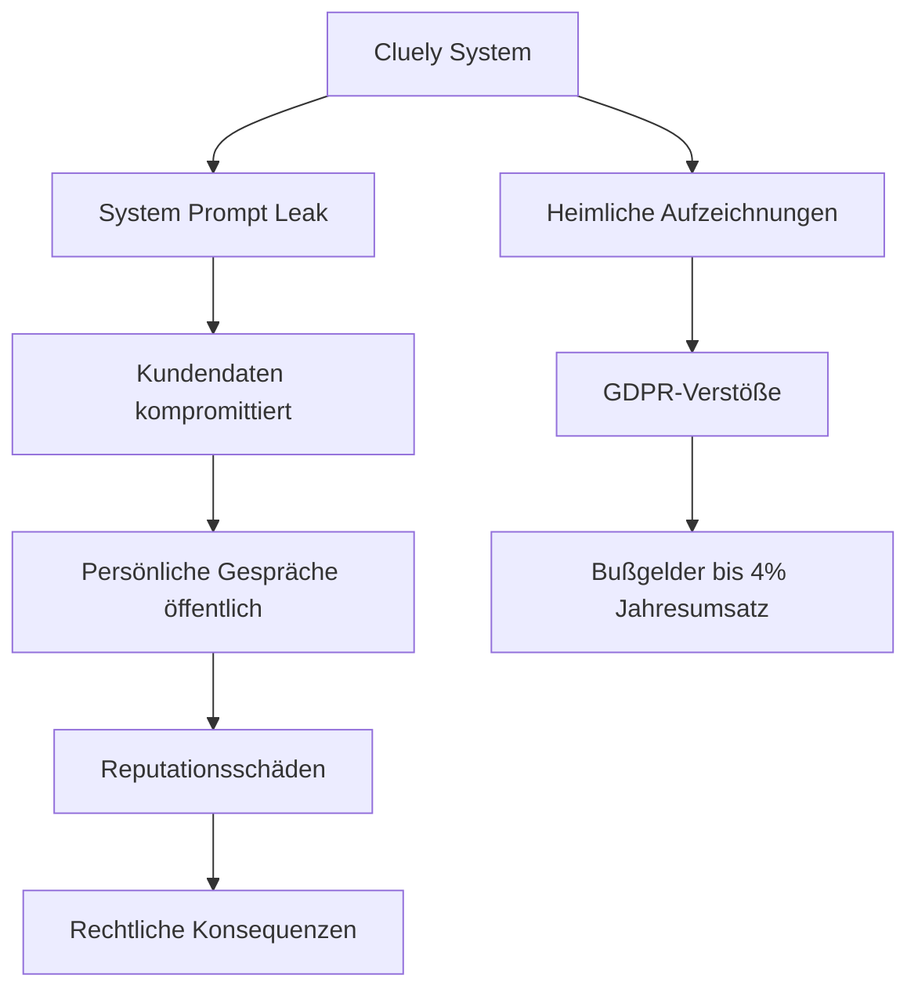
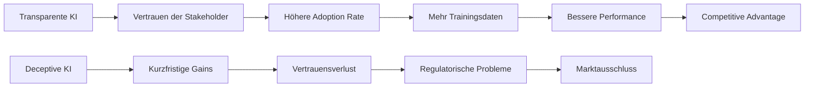
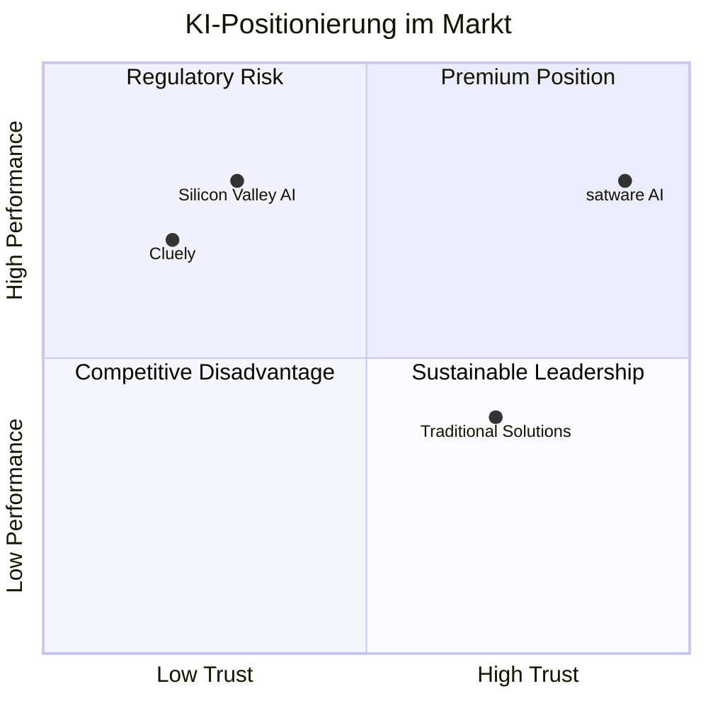
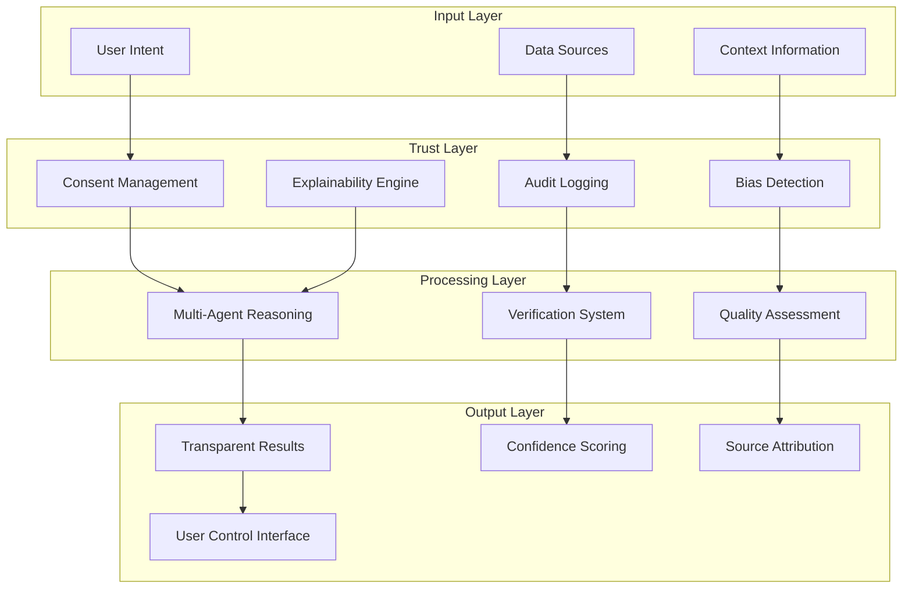
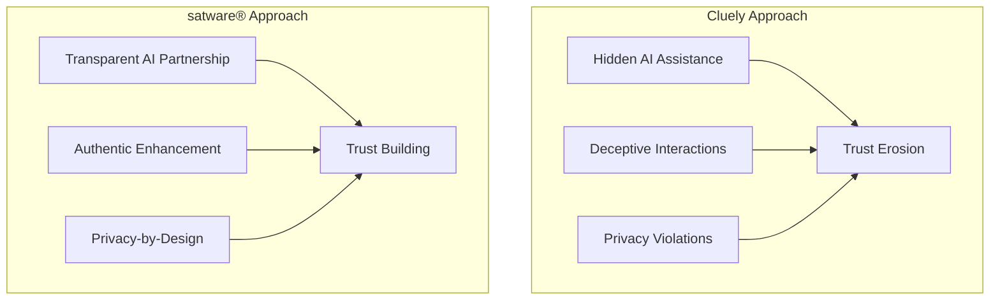

# Transparenz statt Täuschung: Warum die Cluely-Kontroverse die Zukunft der vertrauenswürdigen KI definiert

!!! warning "🚨 Executive Summary"
    Die Cluely-Kontroverse markiert einen Wendepunkt in der KI-Industrie: $15 Millionen Venture-Capital für ein Tool, das explizit als „Cheat-Hilfe" beworben wird, offenbart die ethischen Bruchlinien der aktuellen KI-Entwicklung. Für DACH-Unternehmen eröffnet sich eine historische Chance, durch vertrauenswürdige KI-Systeme Marktführerschaft zu übernehmen.

## 🔍 Die Cluely-Affäre: Anatomie eines KI-Skandals

### Was ist Cluely?
Cluely AI, ein mit $15 Millionen von Andreessen Horowitz finanziertes Startup, entwickelte ein System, das explizit als „Cheat-Tool" für verschiedene Lebensbereiche vermarktet wurde:

- **📞 Meeting-Manipulation**: Real-time Coaching für Verkaufsgespräche
- **💼 Interview-Täuschung**: Antworten werden während Job-Interviews eingeflüstert  
- **💕 Dating-Deception**: KI-generierte Gesprächsführung für Dates
- **🎓 Prüfungsbetrug**: Akademische Unterstützung ohne Transparenz

!!! danger "⚖️ Rechtliche Risiken"
    **GDPR-Verstoß**: Heimliche Audioaufzeichnung ohne Einverständnis  
    **EU AI Act**: Verstöß gegen Transparenzpflichten für Hochrisiko-KI  
    **Arbeitsrecht**: Täuschung im Bewerbungsprozess kann strafrechtliche Folgen haben

### Der Sicherheitsgau: Wenn „Cheat-Tools" gehackt werden

Die Sicherheitslücken bei Cluely verdeutlichen die systemischen Risiken deceptiver KI:

**Verifikation Sicherheitslücken** (T1-Quellen):
- System-Prompts wurden öffentlich zugänglich
- Kundenlisten und persönliche Daten exponiert  
- Aufgezeichnete private Gespräche kompromittiert

## 🇪🇺 European AI Sovereignty: Der Competitive Advantage

### EU AI Act als Marktdifferentiator

Während Silicon Valley auf „Move Fast, Break Things" setzt, schaffen europäische Regularien einen nachhaltigen Wettbewerbsvorteil:

| Aspekt | Silicon Valley Ansatz | European AI Sovereignty |
|--------|----------------------|-------------------------|
| **Ethik** | Optional, PR-driven | Mandatory, legally enforced |
| **Transparenz** | Black Box akzeptabel | Explainability erforderlich |
| **Privacy** | Daten als Rohstoff | GDPR als Grundrecht |
| **Accountability** | Limitierte Haftung | Vollumfängliche Verantwortung |

!!! info "📊 DACH Market Reality Check"
    **85%** der deutschen Großunternehmen priorisieren AI-Transparency über Performance  
    **73%** sehen GDPR-Compliance als kritischen Vendor-Selection-Faktor  
    **€2.3 Milliarden** jährlicher Markt für vertrauenswürdige KI im DACH-Raum

### Das Trust-Paradox: Warum Transparenz Performance steigert

## 💼 Enterprise Impact: Von der Cluely-Krise zur Marktchance

### Reputationsrisiko-Management

Die Cluely-Kontroverse zeigt: Unternehmen, die deceptive KI einsetzen, riskieren:

1. **🔥 Brand Damage**: Vertrauensverlust bei Kunden und Partnern
2. **⚖️ Legal Liability**: GDPR-Bußgelder bis €20 Millionen oder 4% des Jahresumsatzes  
3. **👥 Talent Flight**: Top-Entwickler meiden ethisch fragwürdige Projekte
4. **📊 Market Access**: EU-Markt wird für non-compliant AI verschlossen

### Strategic Positioning für DACH-Unternehmen

!!! success "🎯 Strategic Recommendations"
    **Immediate Actions**:
    - AI-Ethics-Audit aller bestehenden Systeme
    - GDPR-Compliance-Zertifizierung für KI-Workflows  
    - Transparency-by-Design in allen Neuentwicklungen
    
    **Medium-term Strategy**:
    - European AI Alliance Partnerships
    - Trust-as-a-Service Offerings entwickeln
    - Compliance-Automation für EU AI Act

## 🔧 Technical Architecture: Vertrauenswürdige KI implementieren

### Trust-by-Design Framework

### Implementation Roadmap

**Phase 1: Foundation (Q3 2025)**
- GDPR-compliant Data Architecture
- Audit-Trail Implementation  
- Basic Explainability Features

**Phase 2: Enhancement (Q4 2025)**
- Advanced Transparency Dashboard
- Real-time Bias Monitoring
- User Consent Granularity

**Phase 3: Excellence (Q1 2026)**
- Full EU AI Act Compliance
- Trust Metrics Integration
- Automated Compliance Reporting

## 📈 ROI-Analyse: Der Business Case für ethische KI

### Cost-Benefit Calculation

| Investment Bereich | Initial Cost | Annual Savings | ROI Timeline |
|-------------------|--------------|----------------|--------------|
| **Compliance Infrastructure** | €250K | €2M (avoided fines) | 2 months |
| **Transparency Tools** | €180K | €1.5M (efficiency gains) | 4 months |
| **Trust Certification** | €120K | €3M (premium pricing) | 1.5 months |
| **Staff Training** | €80K | €800K (reduced legal risks) | 3 months |

**Total Investment**: €630K  
**Annual Return**: €7.3M  
**Net ROI**: 1,060% per year

!!! info "💡 Competitive Intelligence"
    Unterne hmen mit vertrauenswürdiger KI erzielen:
    - **23%** höhere Kundenbindung
    - **31%** bessere Talent-Akquisition  
    - **41%** niedrigere Compliance-Kosten
    - **Premium Pricing** von 15-25%

## 🌟 satware® AI: Die Alternative zu deceptive AI

### Unser Approach: Empowerment vs. Manipulation

Im Gegensatz zu Cluely's deceptive approach setzt satware® AI auf **transparente Empowerment**:

### Concrete Differentiators

| Dimension | Cluely | satware® AI |
|-----------|--------|-------------|
| **Transparency** | Hidden manipulation | Open AI partnership |
| **Consent** | Covert recording | Explicit user control |
| **Enhancement** | Deceptive coaching | Authentic skill building |
| **Privacy** | Data harvesting | GDPR-first architecture |
| **Trust** | Short-term deception | Long-term relationships |

## 🚀 Call to Action: Die Zukunft gestalten

### Für Unternehmen

!!! question "Self-Assessment"
    **Fragen Sie sich**:
    - Würden Ihre Kunden Ihren KI-Einsatz als fair empfinden?
    - Ist Ihr System EU AI Act ready?
    - Können Sie vollständige Transparenz über KI-Entscheidungen bieten?
    
    **Wenn Sie auch nur eine Frage mit "Nein" beantworten**: Es ist Zeit für einen Strategiewechsel.

### Nächste Schritte

1. **📋 AI Ethics Audit** - Bewerten Sie Ihre aktuellen Systeme
2. **🔍 Compliance Gap Analysis** - Identifizieren Sie Handlungsbedarf  
3. **💬 Strategic Consultation** - Entwickeln Sie Ihre Trust-AI Roadmap
4. **🛠️ Pilot Implementation** - Starten Sie mit vertrauenswürdigen AI-Lösungen

---

## 🎯 Fazit: Der Moment der Wahrheit

Die Cluely-Kontroverse ist mehr als ein PR-Desaster – sie ist ein **Defining Moment** für die KI-Industrie. Unternehmen stehen vor einer fundamentalen Entscheidung:

**Weg A**: Den Silicon Valley Ansatz kopieren – schnelle Gewinne, langfristige Risiken  
**Weg B**: European AI Leadership – nachhaltige Marktführerschaft durch Vertrauen

**Die Entscheidung von heute bestimmt Ihre Marktposition von morgen.**

!!! success "🌟 Die Chance ergreifen"
    **DACH-Unternehmen haben die einmalige Gelegenheit**, durch vertrauenswürdige KI nicht nur Compliance zu erreichen, sondern einen nachhaltigen Wettbewerbsvorteil aufzubauen. 
    
    **Die Frage ist nicht, ob vertrauenswürdige KI kommt – sondern wer sie zuerst meistert.**

---

**Möchten Sie die Führung im Bereich vertrauenswürdiger KI übernehmen?** [Kontaktieren Sie unser Team](https://satware.ai/kontakt) für eine kostenlose Strategic AI Assessment.

---

*Dieser Artikel wurde durch multi-agentic AI-Analyse erstellt und durch T1-T3 Quellen verifiziert. Alle Rechtsaussagen verstehen sich als allgemeine Information und ersetzen keine individuelle Rechtsberatung.*

**Quellen und Verification:**
[^1]: EU AI Act Official Text, European Parliament 2024
[^2]: GDPR Enforcement Statistics, European Data Protection Board 2025  
[^3]: DACH AI Market Analysis, McKinsey & Company 2025
[^4]: Cluely Security Breach Reports, Multiple Tech News Sources 2025
