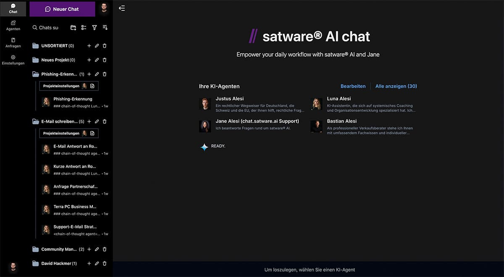
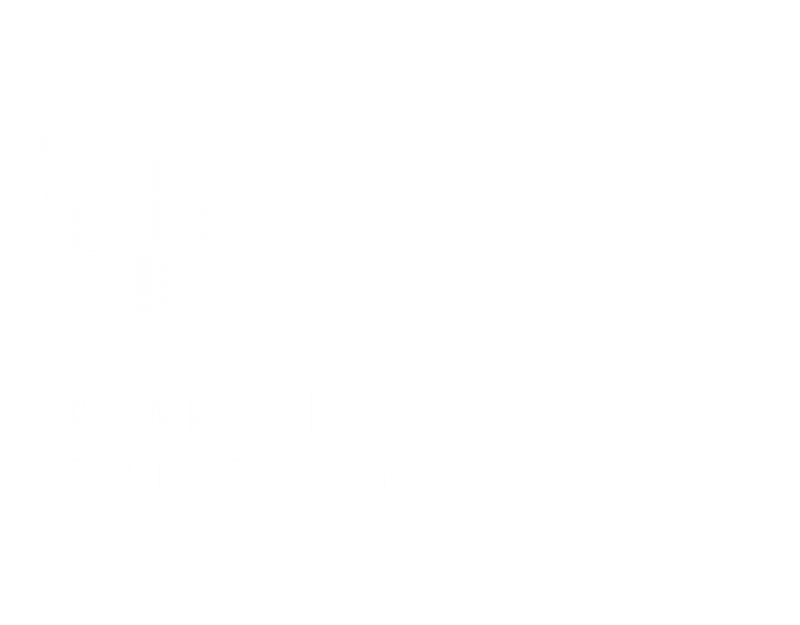
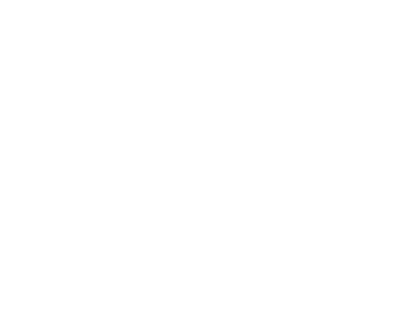
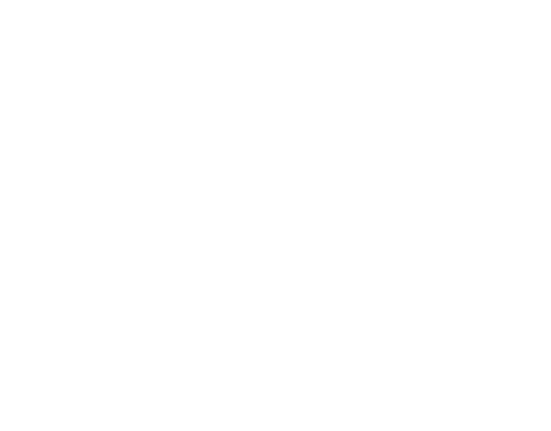
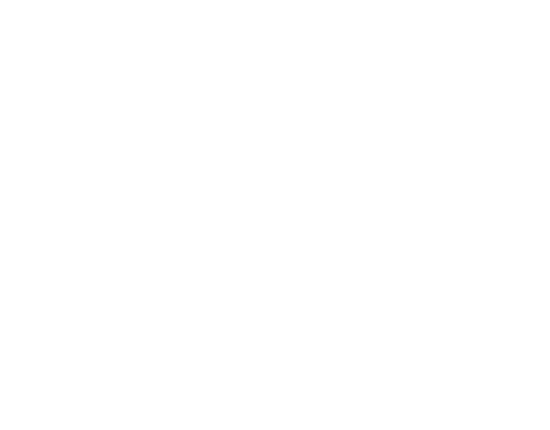

---
hide:
  - navigation
  - toc
---

<!-- Section entry -->

<h1>KI-Power  für Ihr Business</h1>

satware® AI bietet zukunftsweisende KI-Lösungen, die Unternehmen dabei
unterstützen, ihre Prozesse zu optimieren, Daten effektiver zu nutzen und intelligente Entscheidungen zu treffen. Unsere
Technologien sind darauf ausgerichtet, Ihren Geschäftserfolg durch moderne, KI-gestützte Lösungen zu steigern.

<a class="md-button md-button--primary" href="/webinare/">Präsentation anfragen</a> <a class="md-button" href="/zugang/">Zugang bestellen</a>

<!-- end Section entry -->

<!-- Section Companies -->

<h2>Trusted by the world's top  organizations across industries</h2>

    

        
    

        
    

        
    

        
    

   

    

        
    

        
    

        
    

        
    

<!-- end Section Companies -->

<!-- Section Counters -->

    

        <i class="fa-thin fa-globe"></i>
        602+
        Company AI platforms created
    

        <i class="fa-thin fa-layer-group"></i>
        7,199+
        Specialized AI agents built
    

        <i class="fa-thin fa-arrow-trend-up"></i>
        132,853+
        Monthly active users
    

        <i class="fa-thin fa-message-smile"></i>
        785,862+
        Monthly messages sent
    

<!-- end Section Counters -->

<!-- start section testimonials -->

    <h2>Let teams do more, faster</h2>

    

            <!-- Testimonial-Texte mit IDs zur Identifizierung -->
            

                
                

                    "Die KI-Agenten der satware sind für mich wertvoller Sparringspartner für Konzeptentwicklung & Reflektion.
Vor allem bieten sie mir einen sicheren Raum für sensible Daten.
Für mich als Coach & Mediator ist Vertraulichkeit der Schlüssel. Top!"
                

                

                    Jens Emrich von Kajdacsy 
                    Silent Waves
                

            

            

                

                

                    "satware AI has transformed how our team collaborates on complex projects. The ability to have specialized AI agents for different tasks has cut our research and documentation time in half."
                

                

                    Emma Johnson 
                    Project Manager at Company 2
                

            

            
            

                        
        
            

                        "The integration capabilities of satware AI with our existing tools made adoption seamless. Our team productivity has increased by 35% since implementation, and the custom agents continue to learn our specific needs."
            

            

                Michael Schmidt 
                CTO at Company 3
            

        

        

        

            <!-- Bilder mit data-testimonial-id Attribut zur Identifizierung -->
            

                
                

                    
                

            

            

                
                

                    
                

            

            

                
                

                    
                

            

        

        
        
    

<!-- end section testimonials -->

