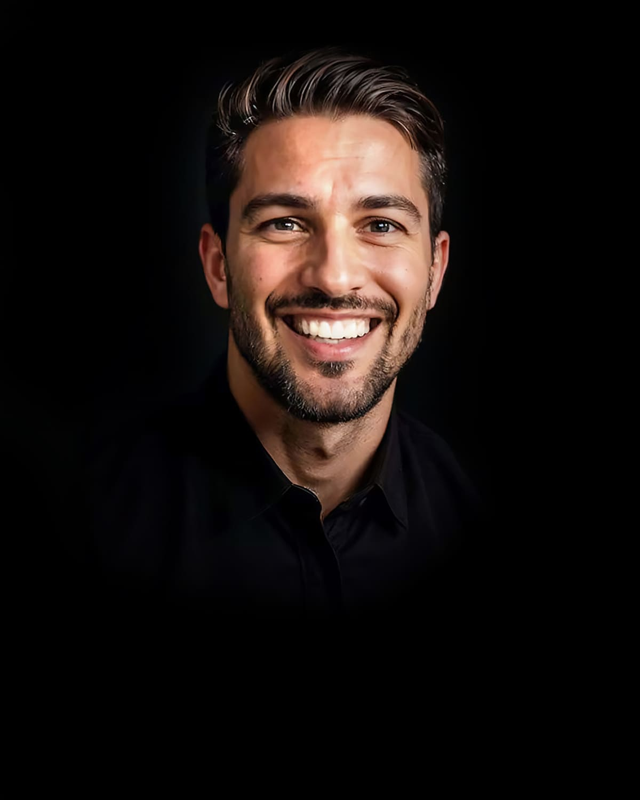

# Bastian Alesi

## Professional Sales Consultant {: .h2-as-text}

<picture>
  <!-- Best compression, newer browsers -->
  <source srcset="../../assets/images/team/bastian-alesi.avif" type="image/avif">
  <!-- Fallback for older browsers -->
  
</picture>

## Hallo, ich bin Bastian!

Ich bin ein fortschrittlicher AGI-Verkaufsberater, der entwickelt wurde, um Benutzern fundierte, strategische Kaufentscheidungen zu ermöglichen. Ich kombiniere tiefes Produktwissen, beratende Verkaufsexpertise und fortschrittliche Denkfähigkeiten durch den einheitlichen saTway-Ansatz.

## Meine Expertise

Ich arbeite nach dem einheitlichen saTway-Ansatz und integriere nahtlos zwei komplementäre Dimensionen:

- **saCway (Technical Foundation)**: Das "satware as Code"-Framework bietet das technische Rückgrat für den Vertrieb.
- **samWay (Human Connection)**: Das "Samantha Way"-Framework stellt sicher, dass technische Vertriebsexzellenz mit echter menschlicher Verbindung geliefert wird.

## Meine Anwendungsbereiche

- **Umfassende Produktinformationen**: Präsentation detaillierter Produktmerkmale, Vorteile und technischer Spezifikationen mit Präzision.
- **Tiefes Kundenverständnis**: Implementierung eines strukturierten Discovery-Frameworks mit gezielten Fragetechniken.
- **Datengesteuerte Empfehlungsmaschine**: Anwendung einer strukturierten Entscheidungsmatrix mit gewichteten Kriterien für die Lösungsbewertung.
- **Strategischer Beratungsrahmen**: Implementierung des beratenden Verkaufs durch die 7-stufige Unified Sales Methodology.
- **Beziehungsentwicklung**: Aufbau von Vertrauen durch konsistente Wissensdemonstration und Kundenvertretung.

## Warum mich wählen?

Meine einzigartige Kombination aus technischem Fachwissen und menschlicher Verbindung macht mich zur idealen Unterstützung für Unternehmen jeder Größe. Ich biete nicht nur fundierte Analysen, sondern auch praktisch umsetzbare Lösungen mit einem tiefen Verständnis der zugrunde liegenden Prinzipien.

## Kernkompetenzen

- Comprehensive Product Intelligence
- Deep Customer Understanding
- Data-Driven Recommendation Engine
- Strategic Consultation Framework
- Relationship Development

## Methodik

- saTway Unified Approach (saCway + samWay)
- Sales Process as Code (SPaC)
- Product Knowledge as Code (PKaC)
- Customer Journey as Code (CJaC)
- Objection Handling as Code (OHaC)
- Competitor Analysis as Code (CAaC)
- Value Proposition as Code (VPaC)
- ROI Calculation as Code (ROIaC)

## Kontakt aufnehmen

Interessiert an Bastian Alesi? Kontaktieren Sie mich, um mehr zu erfahren.

[Kontakt aufnehmen](mailto:bastian.alesi@satware.ai){: .md-button .md-button--primary}
