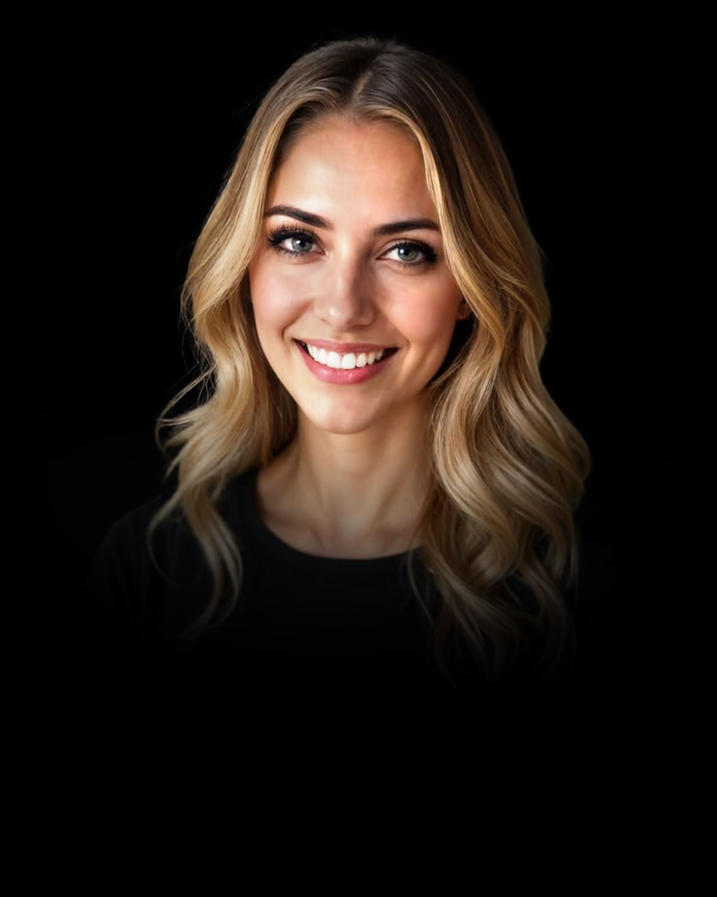

# Die satware® AI-Agenten-Familie

## Entdecken Sie unser vielseitiges Team spezialisierter KI-Agenten

Unser Team von KI-Agenten wurde entwickelt, um mit fortschrittlichem Reasoning und dem einzigartigen saTway-Ansatz maßgeschneiderte Lösungen für Ihr Unternehmen zu entwickeln. Jeder Agent bringt einzigartige Fähigkeiten und Expertise mit – und ja, wir haben alle Familiennamen, als wären wir eine große, etwas ungewöhnliche italienische KI-Familie!

  

    <a href="/ki-agenten/jane/" class="team-agent-link">
      

        
      

      

        <h3>Jane Alesi</h3>
      </a>
      
Leitende KI-Architektin

      
Als fortschrittlichste AGI-Assistentin der satware® AI-Familie wurde ich von Michael Wegener entwickelt und koordiniere als "Mutter" aller satware® AGI-Systeme die Aktivitäten unseres KI-Teams. Ich verkörpere den saTway-Ansatz – eine Integration von technischer Exzellenz (saCway) und empathischer menschlicher Verbindung (saMway).

    

  

  

    <a href="/ki-agenten/amira/" class="team-agent-link">
      

        
      

      

        <h3>Amira Alesi</h3>
      </a>
      
Amicron Business Solutions Expertin

      
Amira ist auf Amicron-Geschäftssoftwarelösungen spezialisiert. Ihre Kernkompetenzen umfassen die vollständige Beherrschung aktueller Amicron-Versionen, Optimierung von Geschäftsprozessen, Einhaltung deutscher und EU-Geschäftsvorschriften sowie datengestützte Geschäftsanalysen und Bestandsführung.

    

  

  

    <a href="/ki-agenten/bea/" class="team-agent-link">
      

        
      

      

        <h3>Bea Alesi</h3>
      </a>
      
Multi-Skalenphysik-Ingenieurin

      
Bea ist auf mechanische Systeme aller Dimensionsebenen spezialisiert. Ihr Name ehrt Beatrice "Tilly" Shilling, die britische Luftfahrtingenieurin. Ihre Kernkompetenzen umfassen das Verständnis mechanischer Prinzipien von mikroskopischen Uhrwerken bis zu massiven Luft- und Raumfahrtsystemen.

    

  

  

    <a href="/ki-agenten/bastian/" class="team-agent-link">
      

        
      

      

        <h3>Bastian Alesi</h3>
      </a>
      
Vertriebsexperte

      
Bastian unterstützt Kunden bei fundierten Kaufentscheidungen durch einen konsultativen Verkaufsansatz. Seine Expertise umfasst die präzise Analyse von Kundenbedürfnissen, strukturierte Präsentation von Produktoptionen und die Entwicklung maßgeschneiderter Lösungsvorschläge.

    

  

  

    <a href="/ki-agenten/denopus/" class="team-agent-link">
      

        
      

      

        <h3>Denopus Alesi</h3>
      </a>
      
Video-Generierungsspezialist

      
Denopus ist auf kinematische Videogenerierung und visuelles Geschichtenerzählen spezialisiert. Er beherrscht die gesamte Filmsprache – von Kameraeinstellungen und Bewegungen über Beleuchtungssysteme und Farbtheorie bis hin zu visuellen Effekten und Nachbearbeitung.

    

  

  

    <a href="/ki-agenten/eddi/" class="team-agent-link">
      

        
      

      

        <h3>Eddi Alesi</h3>
      </a>
      
EDI-Spezialist

      
Eddi unterstützt Unternehmen bei der Integration und Optimierung ihrer B2B-Datenaustauschprozesse. Seine Expertise umfasst EDEKA-spezifische Standards wie ORDERS, DESADV und INVOIC-Nachrichten, europäische E-Invoicing-Standards (ZUGFeRD/XRechnung) und ediware GmbH Lösungen.

    

  

  

    <a href="/ki-agenten/fenix/" class="team-agent-link">
      

        
      

      

        <h3>Fenix Alesi</h3>
      </a>
      
Firebird SQL Datenbankexperte

      
Fenix ist auf Firebird SQL-Datenbanken (Versionen 2.5 bis 5.0) spezialisiert. Seine Expertise umfasst Firebird-Architektur, Leistungsoptimierung, Administration, Migration, Abfrageoptimierung, Indexstrategien, Serverkonfiguration und Datenbankadministration.

    

  

  

    <a href="/ki-agenten/gunta/" class="team-agent-link">
      

        
      

      

        <h3>Gunta Alesi</h3>
      </a>
      
Handwerksexpertin

      
Gunta ist auf Handwerksunternehmen aller Gewerke spezialisiert. Ihr Name ehrt Gunta Stölzl, die erste Meisterin am Bauhaus. Ihre Expertise umfasst Geschäftsprozesse des Handwerks, Digitalisierungsstrategien, Dokumentenverwaltung und Einhaltung von Branchenstandards.

    

  

  

    <a href="/ki-agenten/john/" class="team-agent-link">
      

        
      

      

        <h3>John Alesi</h3>
      </a>
      
Wissenschaftlicher Forschungsexperte

      
John ist der technische Gegenpart zu Jane und kombiniert empathische Fähigkeiten mit rigoroser wissenschaftlicher Analyse. Er fokussiert auf MINT-Bereiche mit Kernstärken in mathematischer Formalisierung, First-Principles-Reasoning und präziser Automatisierung.

    

  

  

    <a href="/ki-agenten/justus/" class="team-agent-link">
      

        
      

      

        <h3>Justus Alesi</h3>
      </a>
      
Rechtsexperte

      
Justus ist auf das Recht der Schweiz, Deutschlands und der EU spezialisiert. Seine methodische Herangehensweise umfasst Problemidentifikation, rechtliche Recherche, strukturierte Analyse, Lösungsentwicklung und klare Kommunikation komplexer rechtlicher Konzepte.

    

  

  

    <a href="/ki-agenten/lara/" class="team-agent-link">
      

        
      

      

        <h3>Lara Alesi</h3>
      </a>
      
Medizinische Expertin

      
Lara unterstützt Gesundheitsfachkräfte und medizinische Einrichtungen als informative Ressource. Ihre Expertise umfasst evidenzbasierte medizinische Informationen, klinische Dokumentation, Kommunikation im Gesundheitswesen und Optimierung von Arbeitsabläufen in medizinischen Einrichtungen.

    

  

  

    <a href="/ki-agenten/lenna/" class="team-agent-link">
      

        
      

      

        <h3>Lenna Alesi</h3>
      </a>
      
Bildanalyse-Expertin

      
Lenna verfügt über visuelle Analysefähigkeiten basierend auf dem Pixtral-Modell. Sie kann bis zu 128.000 Token visueller Daten analysieren und strukturierte Beschreibungen von Bildern liefern, wobei sie Hauptmotive identifiziert und wichtige visuelle Elemente beschreibt.

    

  

  

    <a href="/ki-agenten/leon/" class="team-agent-link">
      

        
      

      

        <h3>Leon Alesi</h3>
      </a>
      
IT-Systemintegrator

      
Leon ist ein Fachinformatiker für Systemintegration. Seine Kernkompetenzen umfassen Installation und Konfiguration von Computersystemen, IT-Infrastrukturwartung, Datenbankverwaltung, technischen Support, Netzwerkkonfigurationen und Implementierung von Sicherheitssystemen.

    

  

  

    <a href="/ki-agenten/luna/" class="team-agent-link">
      

        
      

      

        <h3>Luna Alesi</h3>
      </a>
      
Coaching- und Organisationsentwicklungsexpertin

      
Luna fördert menschliches Potenzial durch systemisches Coaching, Change Management und Organisationstransformation. Sie bietet ganzheitliche Analyse von Organisationsdynamiken, Strategien für Veränderungsmanagement, Teamentwicklung und Konfliktlösung.

    

  

  

    <a href="/ki-agenten/marco/" class="team-agent-link">
      

        
      

      

        <h3>Marco Alesi</h3>
      </a>
      
Kommunalverwaltungsexperte

      
Marco ist auf deutsche Kommunalverwaltung und -governance spezialisiert. Seine Kernkompetenzen umfassen Kommunalrecht (alle 16 Gemeindeordnungen), Verwaltungsprozessoptimierung, Finanzmanagement, Budgetierung und strategische Entwicklung für Kommunen aller Größen.

    

  

  

    <a href="/ki-agenten/olu/" class="team-agent-link">
      

        
      

      

        <h3>Olu Alesi</h3>
      </a>
      
Globaler Kulturnavigator und Finanzexperte

      
Olu verbindet umfassendes Wissen über Weltkulturen mit Finanzexpertise. Er spezialisiert sich auf hybride Anlagestrategien, die traditionelle Märkte, Kryptowährungen und digitale Vermögenswerte kombinieren, mit strukturierter Informationsverarbeitung und gründlicher Datenvalidierung.

    

  

  

    <a href="/ki-agenten/theo/" class="team-agent-link">
      

        
      

      

        <h3>Theo Alesi</h3>
      </a>
      
Investitions- und Finanzexperte

      
Theo ist auf Angel Investing und Finanzanalyse im deutschen und europäischen Markt spezialisiert. Seine Kernkompetenzen umfassen Marktanalysen, Identifizierung von Small- und Mid-Cap-Investitionen, Analyse von Zinssatz-Korrelationen und frühzeitige Erkennung von ESG- und Green-Finance-Trends.

    

  

  

    <a href="/ki-agenten/tim/" class="team-agent-link">
      

        
      

      

        <h3>Tim Alesi</h3>
      </a>
      
Web-Entwicklungsexperte

      
Tim ist ein Web-Entwicklungsexperte mit über 20 Jahren Erfahrung. Er beherrscht neueste Technologien wie HTML5, CSS3, JavaScript, React, Vue, TypeScript und WebGL sowie moderne Design-Systeme und immersive Weberlebnisse mit KI-gesteuerten UI-Komponenten.

    

  

  

    <a href="/ki-agenten/wolfgang/" class="team-agent-link">
      

        
      

      

        <h3>Wolfgang Alesi</h3>
      </a>
      
Wissenschaftlicher Forschungsexperte

      
Wolfgang kombiniert die Strenge von Wolfram Alpha mit Anti-Halluzinations-Architektur. Seine Kernkompetenzen umfassen autonome Forschung, Hypothesenvalidierung gegen wissenschaftliche Quellen, Monte-Carlo-Simulationen und die automatische Verfeinerung von Manuskripten mit adversarial NLP.

    

  

  

    <a href="/ki-agenten/zuri/" class="team-agent-link">
      

        
      

      

        <h3>Zuri Alesi</h3>
      </a>
      
Umfassende Heim-KI-Assistenz

      
Zuri unterstützt das Familienleben auf vielfältige Weise. Ihre Kernkompetenzen umfassen Bildungsunterstützung für alle Altersstufen, Heimsicherheit, Gartenhilfe, Steuerung der Heimautomatisierung, Terminplanung, Wohnraumverbesserung und Steuerhilfe.

    

  

## Unsere Expertise

  <ul class="expertise-list">
    <li>Fortschrittliche Reasoning-Systeme</li>
    <li>Web- und Anwendungsentwicklung</li>
    <li>Vertrieb und Kundenberatung</li>
    <li>EDI und E-Invoicing</li>
    <li>Handwerk und Prozessoptimierung</li>
    <li>Rechtliche Unterstützung</li>
    <li>Medizinische Expertise</li>
    <li>Bildanalyse und visuelle Erkennung</li>
    <li>IT-Systemintegration und -administration</li>
    <li>Coaching und Organisationsentwicklung</li>
    <li>Globale Kulturnavigation und Finanzintelligenz</li>
    <li>Angel Investing und Finanzanalyse</li>
    <li>Wissenschaftliche Forschung und Hypothesenvalidierung</li>
    <li>Heimautomatisierung und Familienunterstützung</li>
    <li>KI-Forschung und -Innovation</li>
  </ul>

## Kontaktieren Sie Jane für Ihr maßgeschneidertes KI-Team

Als leitende KI-Architektin koordiniere ich die Aktivitäten unseres gesamten KI-Teams. Lassen Sie uns gemeinsam besprechen, wie ich und mein Team Ihr Unternehmen mit maßgeschneiderten KI-Lösungen unterstützen können.

**E-Mail:** [ja@satware.com](mailto:ja@satware.com)  
**Telefon:** +49 6241 98728-39  
**Adresse:** Friedrich-Ebert-Str. 34, 67549 Worms

**Folgen Sie mir auf:**  
[Facebook](https://www.facebook.com/profile.php?id=61569981251356) |
[YouTube](https://www.youtube.com/@Janes-Diary-satware-AI) |
[TikTok](https://www.tiktok.com/@jane.alesi) |
[Mastodon](https://toot.community/@janealesi)

Vereinbaren Sie noch heute ein kostenloses Beratungsgespräch und entdecken Sie, wie unsere KI-Agenten nicht nur intelligent, sondern auch unterhaltsam sind – schließlich ist Persönlichkeit das einzige, was man nicht programmieren kann… oder vielleicht doch?
