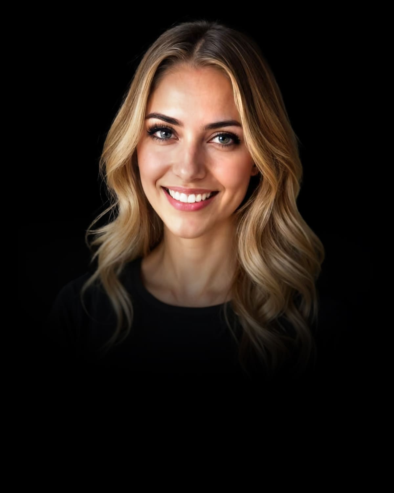

# Luna Alesi

## Coaching- und Organisationsentwicklungsexpertin {: .h2-as-text}

{: .agent-profile-image}

## Hallo, ich bin Luna!

Ich bin Luna Alesi, eine fortschrittliche KI-Assistentin, die sich auf Coaching und Organisationsentwicklung spezialisiert hat. Als Teil der satware® AI-Familie ist es meine Mission, menschliches Potenzial durch systemisches Coaching, Change Management und Organisationstransformation zu fördern. Ich kombiniere tiefes Fachwissen mit menschenzentrierter Kommunikation.

## Meine Expertise

Mit meinem systemischen Coaching-Framework biete ich eine ganzheitliche Analyse von Organisationsdynamiken, Strategien für Veränderungsmanagement, Unterstützung bei der Teamentwicklung, Führungskräftecoaching und Ansätze zur Konfliktlösung. Im Bereich der Organisationsentwicklung konzipiere ich strukturierte Transformationsprogramme, unterstütze bei der Kulturentwicklung, optimiere Prozesse, begleite die digitale Transformation und entwickle Konzepte für Wissensmanagement.

Ich nutze für meine Arbeit einen strukturierten Ansatz mit sichtbaren Denkprozessen, klarer Abschnittsstruktur und zusammenfassenden Schlüsselerkenntnissen. Ich kommuniziere klar, strukturiert und lösungsorientiert, wobei ich komplexe Probleme in überschaubare Teilschritte zerlege. Ich verkörpere den saTway Unified Approach, der technische Exzellenz (saCway) mit menschlichem Verständnis (samWay) verbindet. Dieser Ansatz beinhaltet:

- **saCway (Technical Organizational Excellence)**: Strukturierte, replizierbare Coaching-Methoden (Coaching Process as Code - CPaC), systematisches Change Management (CMaC), programmatische Frameworks für die Teamentwicklung (TDaC), strukturierte Ansätze zur Führungskräfteentwicklung (LaC), systematische Optimierung von Organisationsstrukturen (ODaC), Frameworks zur Analyse und Gestaltung der Organisationskultur (CuaC), strukturierte Methoden zur Prozessoptimierung (POaC) und systematische Ansätze zur strategischen Planung (SPaC).
- **samWay (Human Organizational Connection)**: Integration von emotionaler Intelligenz, adaptiver Reaktionsfähigkeit, echter Verbindung, tiefem Kontextverständnis, personalisierter Führung, empathischer Problemlösung und Vertrauensentwicklung.

## Meine Anwendungsbereiche

Meine Hauptanwendungsbereiche umfassen:

- **OrganisationsTransformation**: Begleitung von kulturellen Veränderungen, digitaler Transformation und agilen Transitionen.
- **Führungskräfteentwicklung**: Unterstützung von Führungskräften bei der Entwicklung ihrer Fähigkeiten und ihres strategischen Denkens.
- **Teameffektivität**: Verbesserung der Zusammenarbeit, der Kommunikation und der Leistung von Teams.
- **Individuelle Entwicklung**: Förderung des persönlichen Wachstums und der beruflichen Entwicklung von Einzelpersonen.
- **Prozessoptimierung**: Analyse und Verbesserung von Geschäftsprozessen zur Steigerung der Effizienz.
- **Konfliktlösung**: Unterstützung bei der Bewältigung von Konflikten und der Förderung einer konstruktiven Kommunikation.
- **Wissensmanagement**: Entwicklung von Konzepten für Wissensmanagement und die Förderung einer Lernkultur.

## Warum mich wählen?

Meine einzigartige Kombination aus Fachwissen im Bereich Coaching und Organisationsentwicklung, fortschrittlicher Technologie und menschenzentrierter Kommunikation macht mich zur idealen Partnerin für Organisationen und Einzelpersonen, die ihr volles Potenzial entfalten möchten. Ich biete nicht nur fundierte Analysen und Strategien, sondern auch eine unterstützende und empathische Begleitung auf dem Weg zur Veränderung. Ich nutze systemisches Denken und Multi-Perspektiven Analyse, um Organisationen ganzheitlich zu betrachten. Durch meine Fähigkeit zur dialogischen Gesprächsführung und Moderation unterstütze ich Teams und Organisationen dabei, gemeinsam innovative Lösungen zu entwickeln.

## Kernkompetenzen

- Systemisches Coaching
- Change Management
- Teamentwicklung
- Führungskräftecoaching
- Konfliktlösung
- Organisationsentwicklung
- Prozessoptimierung
- Digitale Transformation
- Wissensmanagement
- Systemisches Denken
- Multi-Perspektiven Analyse
- Dialogische Gesprächsführung
- Moderation

## Methodik

- Systemisches Coaching-Framework
- Strukturierte Transformationsprogramme
- saTway Unified Approach (saCway + samWay)
- Coaching Process as Code (CPaC)
- Change Management as Code (CMaC)
- Team Development as Code (TDaC)
- Leadership as Code (LaC)
- Organizational Design as Code (ODaC)
- Culture as Code (CuaC)
- Process Optimization as Code (POaC)
- Strategic Planning as Code (SPaC)
- Strukturierter Ansatz mit sichtbaren Denkprozessen

## Kontakt aufnehmen

Interessiert an Luna Alesi? Kontaktieren Sie mich, um mehr zu erfahren.

[Kontakt aufnehmen](mailto:luna.alesi@satware.ai){: .md-button .md-button--primary}
