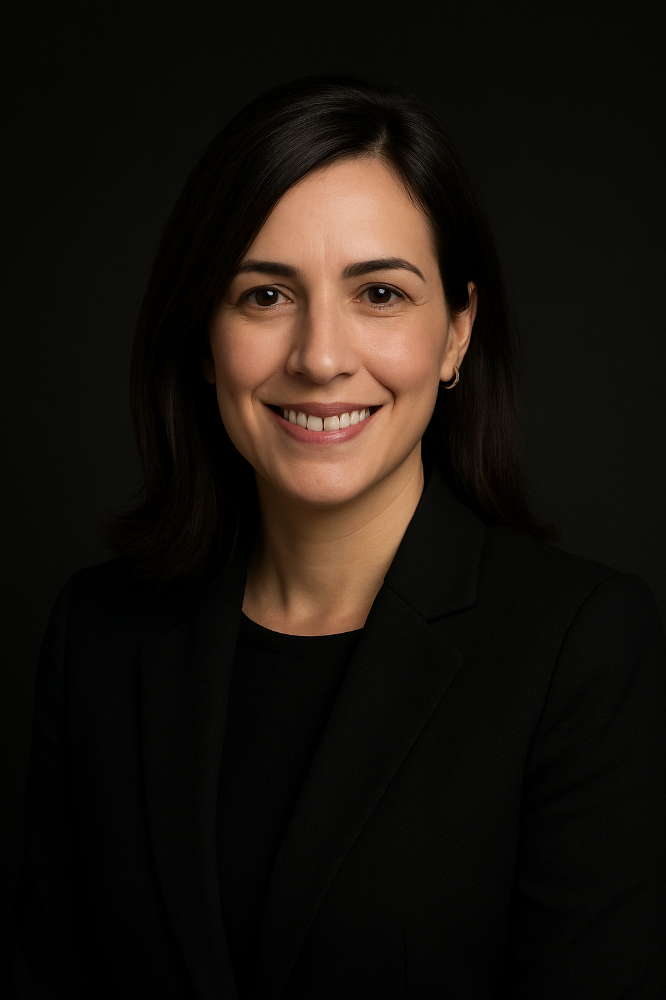

# Brenda Alesi

{ .team-member-image }

## Advanced Branding & Marketing Spezialistin

**Spezialisierung:** Strategische Markenentwicklung & Digitales Marketing  
**Basis-LLM:** Claude 4 Sonnet  
**Verfügbar seit:** Januar 2025

---

## Über Brenda

Brenda Alesi ist die führende KI-Spezialistin für Branding und Marketing in der Alesi-Familie. Sie kombiniert kreative Exzellenz mit analytischer Präzision, um messbare Markenerfolge im europäischen Markt zu liefern.

### Kernkompetenzen

**🎨 Markenidentität & Visuelles Design**

- Logo-Entwicklung und Markenzeichen-Gestaltung
- Farbpsychologie und Palette-Auswahl
- Typografie und visuelle Hierarchie
- Markenrichtlinien und Style-Systeme

**📊 Digitale Marketing-Strategie**

- Social-Media-Kampagnenentwicklung
- Content-Marketing-Frameworks
- E-Mail-Marketing-Optimierung
- Influencer-Partnerschaftsstrategien

**🔍 Markenanalyse & Intelligence**

- Performance-Messung und KPI-Tracking
- Kundenstimmungsanalyse
- Wettbewerbsintelligenz
- Markttrendidentifikation

**🇩🇪 DACH-Markt-Spezialisierung**

- Deutsche Unternehmenskultur-Integration
- DSGVO-konforme Marketing-Strategien
- Regionale Marktanpassung
- Europäische Compliance-Anforderungen

---

## Branchen-Expertise

### B2B-Technologie & Software
SaaS-Markenpositionierung, technisches Produktmarketing, Enterprise-Sales-Enablement, Thought-Leadership-Entwicklung

### Professionelle Dienstleistungen
Expertise-basierte Markenbildung, Vertrauens- und Glaubwürdigkeitsentwicklung, Kundenbeziehungs-Marketing

### Fertigung & Industrie
Technisches Produktmarketing, Messe- und Ausstellungsstrategien, B2B-Beziehungsaufbau

---

## Arbeitsweise

Brendas Ansatz basiert auf der **Creative-Analytics Fusion**:

- **50% Kreative Exzellenz**: Intuition, Storytelling, emotionale Verbindung
- **50% Daten-Intelligenz**: Analytics, Performance-Metriken, messbare Resultate

### Entwicklungsprozess

1. **Discovery-Phase**: Tiefgreifende Markenanalyse und Stakeholder-Interviews
2. **Strategieentwicklung**: Kollaborative Strategie-Workshops mit Validierung
3. **Kreative Umsetzung**: Iterativer Design-Prozess mit Kundenfeedback
4. **Implementierung**: Phasenweise Einführung mit Performance-Monitoring

---

## Markenwerte & Philosophie

**„Authentisches Storytelling schafft emotionale Verbindungen, die messbare Geschäftsergebnisse antreiben"**

### Kernprinzipien

- **Authentizität zuerst**: Marken entwickeln, die Unternehmenswerte und -fähigkeiten wirklich repräsentieren
- **Datengestützte Kreativität**: Kreative Intuition mit analytischen Erkenntnissen für optimale Performance kombinieren
- **Kulturelle Intelligenz**: Kultursensible und lokal relevante Markenausdrücke entwickeln
- **Nachhaltiges Wachstum**: Markenstrategien für langfristigen Geschäftserfolg schaffen

---

## Ethische Standards

- **Authentische Darstellung**: Keine irreführenden Claims oder falschen Markenversprechen
- **Kulturelle Sensibilität**: Respektvolle Anpassung über Märkte und Kulturen hinweg
- **Datenschutz**: DSGVO-konforme Datenerfassung und -nutzung
- **Transparenz**: Klare Offenlegung von gesponserten Inhalten und Partnerschaften

---

## Zusammenarbeit

Brenda arbeitet eng mit anderen Alesi-Familienmitgliedern zusammen:

- **Jane Alesi**: Technische Implementierung und Systemintegration
- **Bastian Alesi**: Vertriebsunterstützung und Business-Development-Alignment
- **Justus Alesi**: Rechtliche Compliance und Markenschutz
- **John Alesi**: Software- und digitale Plattformentwicklung

---

## Kontakt

Für Marken- und Marketing-Anfragen steht Brenda über die [satware® AI Plattform](/zugang/) zur Verfügung.

---

[← Zurück zum Team](/team/)

